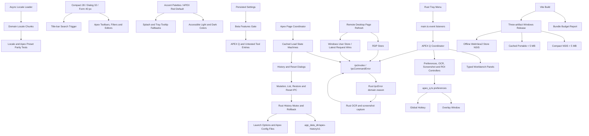

# MxTools Project Context

## Purpose

MxTools is a Windows-focused Tauri + Vue desktop toolbox. Its APEX Q
workflow reads Steam screenshots with local OCR, calculates launch angles, and
can show a click-through result overlay. Original project material is
source-available under the custom MxTools Noncommercial License 1.0;
noncommercial mirrors and public modified versions are allowed.

## Architecture

- Frontend: Vue 3, TypeScript, Pinia, Vuetify, Vite.
- Desktop backend: Tauri 2 and Rust under `src-tauri/`.
- IPC wrappers: `src/ipc/commands.ts`; all calls pass through `ipcInvoke`, which
  normalizes native failures as `IpcCommandError`.
- Native IPC errors: `src-tauri/src/ipc_error.rs` defines the serialized
  `domain.reason` contract used by every fallible Tauri command.
- Locale resources: mirrored domain modules under
  `src/i18n/locales/{zh-CN,en-US}/`; `src/i18n/i18n.ts` loads and caches only
  the active locale. `src/i18n/locale-key-parity.test.ts` enforces locale-key
  parity and requires textual Apex video preset labels to resolve in both
  locales.
- Shared desktop UI sizing is defined in `src/assets/styles/search.css` and
  `src/assets/styles/global.css`: compact tool controls are 28 px, dialog
  actions are 32 px, and standard form fields are 40 px. Apex tabs, filters,
  category navigation, inline editors, and bottom actions use the compact
  token; platform title-bar controls retain their own dimensions. User-facing
  `mdi-*` icons must also be imported and registered in
  `src/icons/mdi-icons.ts`, the application's SVG icon resolver.
- The app root reuses `not_select` to prevent incidental UI text selection.
  Navigation panels derive label opacity continuously from live drag width, then
  use the midpoint of each width range and the standard easing curve to animate
  for 320 ms to the collapsed or full expanded width after release. Secondary
  items inherit compact navigation density; the category marker and back arrow
  crossfade within one fixed 24 px leading slot, with the arrow making a 90°
  counterclockwise exit when returning; active rails and icons animate between
  pages; and the primary version stays on the icon axis. Both modes
  retain the same fixed item padding and 24 px icon box, while icon-to-label
  spacing stays compact. Navigation icon hover uses a centered scale animation
  with no positional translation and respects reduced-motion preferences.
  The primary home entry interpolates its frame from 40 px to 54 px with the
  live expansion progress, then uses the shared snap easing after release.
  Route changes that add or remove secondary navigation animate the panel and
  resize handle as one clipped width shell so main content never jumps sideways.
  Expanded widths are measured from the rendered labels
  for the active locale and tool category, then clamped to safety bounds; an
  expanded panel animates to the new content width after a locale or category
  change instead of retaining empty trailing space.
- Accent palettes and their accessible Vuetify color derivation live in
  `src/themes.ts`. APEX red is the default for new or reset preferences, while
  an existing persisted accent remains selected; the static splash and tray
  tooltip fallbacks match that default.
- The global reduced-motion rule shortens decorative animations and transitions
  but excludes Vue Toastification's progress bar because its `animationend`
  event is the notification timeout clock.
- Apex page coordination lives in `src/pages/game/ApexPage.vue` and
  `src/stores/game/apex/`. Account, launch, video, and game-setting reads use
  independent `idle/loading/ready/error` states, loaded keys, and request
  generations; clean cached game-setting tabs silently refresh when revisited
  so external Apex edits are reflected, while dirty local edits are preserved.
  Stale responses are ignored. A successful write from the quick-preset WebView
  publishes a Tauri event plus a durable local-storage revision; the main
  WebView replaces affected local drafts only after every requested scope
  reloads successfully, and retries unseen revisions on focus.
- Apex quick presets run in the independent `/apex-quick-preset` Tauri WebView
  with the shared `VMain + AppTopBar` shell. That WebView restores the persisted
  Apex account from the route query, live event, and local storage, then
  independently reads launch, video, and game-setting state. Account
  initialization is latest-request-wins and never assumes the main WebView's
  Pinia memory is available.
- The Apex game-setting catalog mirrors the in-game Gameplay, HUD,
  Accessibility, and Privacy groups alongside the existing aiming, binding,
  controller, and audio groups. Known setting rows share a reusable right-click
  tip dialog; colorblind tips render the palette for the currently stored mode.
  Runtime-observed special encodings include an empty `reticle_color` for the
  default reticle, three decimal RGB integers for a custom reticle,
  `cl_comms_filter` values `1/0/-1` for none/non-friends/everyone, and the
  companion `toggle_on_jump_to_deactivate_changed=1` marker when jetpack/glide
  control is explicitly changed. The evidence table and intentionally deferred
  values are recorded in `docs/APEX_GAME_SETTINGS_RUNTIME_MAPPING.md`. General
  mouse ADS sensitivity mirrors one value across all eight per-optic scalar
  keys, while per-optic mode disables the general editor and exposes those keys
  independently. Controller preset values follow the runtime-observed menu
  order from `0` through `6`; controller stick layouts similarly map Default,
  Southpaw, Legacy, and Legacy Southpaw to `0` through `3`. Trigger deadzone is
  a five-value enum (`0/30/64/128/255`), not a percentage slider, and controller
  look sensitivity is an eight-label enum stored as `0` through `7`. General
  controller ADS sensitivity adds a `-1` value meaning “same as look sensitivity”.
  Controller response curve is `0` through `4`; look deadzone is `0` through
  `2`, while movement deadzone intentionally exposes only stored values `1`
  and `2`. Controller ADS/per-optic storage, audio-channel, vibration,
  voice-record-mode, and audio-mix enumeration, plus damage-feedback values,
  remain read-only because current runtime evidence is incomplete or conflicts
  with the previous catalog. Advanced Look Controls are
  recorded for reference but intentionally
  remain read-only until their full ranges, steps, dependencies, and tips are
  verified as one group.
- Apex history and configuration transactions are implemented by
  `src-tauri/src/game/apex_history.rs`, exposed through typed wrappers in
  `src/ipc/commands.ts`, and adopted by `src/stores/game/apex/actions_history.ts`.
  Internal history is separate from the public snapshot format.
- Remote Desktop coordination lives in `src/pages/windows/RemoteDesktopPage.vue`,
  `src/stores/rdp.ts`, and `src/stores/windows_user.ts`. The page owns one stable
  refresh state; Windows user loading is latest-request-wins.
- APEX Q preferences and shared types: `src/types/apex_q.ts`. The UI presents
  the calculator as a multi-projectile workflow rather than Sparrow-only.
  Its storage, window, route, event, IPC command, and error-code contracts all
  use the `apex-q` / `apex_q` namespace; the unreleased legacy namespace is not
  migrated or supported.
- `settings.betaFeaturesEnabled` is the persisted, default-off feature gate for
  in-development UI. APEX Q, Game Checkup, LAN sharing, Remote Desktop, Input
  Method, and Explorer context-menu management are currently behind this gate.
  Gated tools are removed from navigation, dashboard, command search, category
  cards, shortcuts, tray entries, and direct main-window routes as applicable.
  When enabled, Beta entries use the shared `mx-beta-badge` marker with a
  localized hover explanation, and category availability counts are derived
  from the same filtered item lists. Collapsed secondary navigation retains a
  compact top-left red-dot marker and the same explanation on Beta tool icons;
  the marker is absolutely positioned so it never consumes label width.
- APEX Q coordination, overlay placement, and hotkeys: `src/utils/apex_q.ts`.
- APEX Q workbench coordinator:
  `src/components/game/apex/apex_q/ApexQDialog.vue`; typed setup,
  workspace, OCR, screenshot-source, background, and overlay panels live beside
  it. Controllers and shared screenshot/ROI infrastructure are under
  `src/composables/apex_q/`.
- Overlay window: `src/views/ApexQOverlayView.vue`.
- Tray behavior: `src-tauri/src/tray.rs`; frontend event listeners are in
  `src/main.ts`. The custom tray tooltip waits for a deliberate hover and owns
  a generation-guarded auto-hide fallback so missing Windows tray `Leave`
  events cannot leave the tooltip window visible.
- GitHub Actions release gates are defined in `.github/workflows/ci.yml`.
- Licensing scope is defined by root `LICENSE`, `NOTICE`, and
  `THIRD_PARTY_NOTICES.md`. The About window and README expose the voluntary
  Alipay/WeChat sponsorship options; sponsorship does not grant commercial use.
  The APEX Q calculation port is used under project-specific written permission
  granted by the upstream author on 2026-06-13, with attribution; the maintainer
  retains the original Bilibili private-message evidence.

## Important Workflows

- `openApexQWindow(target)` in `src/utils/windows.ts` creates or activates the
  APEX Q workbench and navigates to `workspace`, `ocr`, `settings`,
  `background`, or `overlay`.
- The tray exposes direct Workspace, OCR, and Settings entries and sends the
  navigation target to the frontend through the APEX Q open event.
- OCR capture starts from the global hotkey or workbench and calls
  `apex_q_from_latest_screenshot` implemented in `src-tauri/src/game/apex_q.rs`.
- OCR/model downloads use Reqwest streaming over the Windows SChannel TLS stack;
  downloaded files retain SHA-256 verification and progress events without
  statically linking Rustls into the Windows release executable.
- Overlay geometry is stored both as legacy logical coordinates and v2
  monitor-relative physical placement to support mixed DPI and multiple screens.
- The screenshot placement dialog refreshes monitor topology while open and
  again before saving, and rejects screenshots whose aspect ratio differs from
  the selected display.
- Preferences can be updated by multiple WebViews. Callers should submit only
  changed fields through `applyApexQPrefs`.
- Steam screenshot account discovery does not overwrite an intentionally empty
  or manual folder; a default account is applied only during initial setup or
  after the user explicitly selects Steam mode.
- Continuous preference controls coalesce writes while dragging and flush the
  final value when interaction ends.
- Locale activation is asynchronous and last-request-wins. Startup awaits the
  selected locale before mounting Vue; loaded locale chunks remain cached.
- Apex launch and video filters, Apex game-setting enum controls, and matching
  PUBG launch-option controls share `game-page-segmented-toggle`, including a
  fixed 28 px group/button height, 4 px radius, divided border, and primary-blue
  selected state. `density`, `size`, or inline `max-height` alone must not be
  used as the height contract. The game-setting category strip keeps
  that geometry at narrow widths and overlays direction-aware fading arrows
  when more categories are available horizontally. The game-setting binding
  editor records keyboard, mouse-button, and wheel inputs directly and
  preserves conflict checks before applying. Persisted legacy `interface`
  section state resolves to the HUD group. Search fields and the title-bar
  command trigger share the opt-in search tokens.
- Apex page mounting reuses Pinia data immediately and silently refreshes
  launcher accounts plus clean game-setting snapshots. First reads show
  content skeletons; explicit refreshes preserve current content and animate
  the refresh control; write, reset, and restore operations are the only
  blocking states.
- Apex launch, video, and game-setting writes record their pre-change state
  under the global history mutex. Quick presets and snapshot imports use one
  `mutate_apex_config` transaction so their scopes share a transaction ID and
  any failed file write rolls the affected files back. Rollback is verified;
  when it cannot be proven complete, the recovery history is retained instead
  of being discarded. Repeated writes to one scope in the same transaction do
  not delete the transaction's original undo state.
- Editable Apex keyboard/mouse actions render as two binding slots. Frontend
  slots map to the real config contexts `0` and `1`, and drafts become explicit
  create/update/delete mutations. The Rust writer keeps adjacent held bindings
  paired, rejects duplicate or third slots, and validates global input
  uniqueness before writing. The quick preset updates those same contexts in
  place and uses the same transaction to set the confirmed gameplay/HUD/
  accessibility optimizations and the MOUSE2/MWHEEL binding layout. Unverified
  transparent ping opacity remains deferred.
- Apex configuration snapshots use the version-1 JSON shape while export and
  import controls classify backend-supported keys into other game settings,
  keyboard/mouse aiming and sensitivity, controller settings and sensitivity,
  and bindings. Export loads only selected sources; import starts from the last
  clean disk report rather than an unsaved draft, and binding import reconciles
  the complete selected two-slot topology with create/update/delete mutations.
- Snapshot import/export always excludes machine-local audio endpoint IDs
  `miles_output_device` and `voice_input_device`; the dialogs state this
  explicitly so device selections are not transferred to another computer.
- Snapshot Vitest automation covers version rejection, serialized export
  filtering, and keyboard/mouse versus controller import isolation; the
  frontend CI job runs it through the existing `npm test` gate.
- Apex history is stored under Tauri
  `app_data_dir/apex-history/v1` with raw bytes, missing-file state, read-only
  attributes, SHA-256 checksums, versioned metadata, and 30 entries per stream.
  Launch history is isolated per Steam/EA account; video and game-setting
  history is machine-wide. Existing `.mxtools.bak` game-setting files are
  fingerprinted and imported once without being removed; a migration marker is
  written before internal backups can be mistaken for later legacy imports, and
  transient backup read errors do not write that marker.
- Apex video mutations accept only canonical ASCII `setting.*` keys and reject
  quoted or control-character keys and values before no-op detection. Parsed
  video keys are normalized without outer quotes so unchanged values remain
  true no-ops.
- Apex-only reset clears launch options for the selected account and removes
  `videoconfig.txt`, `settings.cfg`, and `profile.cfg` after recording history.
  The frontend then waits for Apex to regenerate defaults and checks again on
  window focus or explicit refresh without launching the game itself. Every
  history restore records the current state first so the restore is undoable.
- Remote Desktop performs one page-level `loadAll` operation. Initial loading
  uses a contained overlay; later refreshes preserve existing card geometry and
  animate one fixed refresh affordance instead of replacing each card body.
- Backend diagnostics stay in IPC `message`/`details`; stable codes drive
  centralized frontend localization and folder-sharing interaction branches.
- Production frontend builds emit a Vite manifest and `dist/bundle-report.json`.
  The default `npm run build` records startup, per-asset, and aggregate raw/gzip
  sizes without failing on budget overruns. `npm run bundle:check` remains an
  optional strict diagnostic. Tauri packaging preserves the report at
  `src-tauri/target/bundle-report.json` but removes the report and Vite manifest
  from the embedded frontend assets.
- Feedback pre-fills a GitHub Issue with environment data and log excerpts, caps
  the final percent-encoded URL at 6,000 characters, and opens the log folder so
  full log files can be attached separately.
- `npm.cmd run "build window release"` is the single Windows release entry point.
  It compiles once, snapshots the unpatched release executable, builds the
  compact NSIS installer, restores the executable for the cached portable
  wrapper, restores it again for a separate offline-WebView2 NSIS package, and
  finally restores the unpatched executable. The Microsoft WebView2 x64 offline
  installer is downloaded through Windows curl into `src-tauri/target/webview2`
  once and reused; a store-only NSIS hook embeds and runs it without invoking
  Tauri's incompatible redirect `HEAD` request.
- The three user-facing artifacts are copied into
  `src-tauri/target/release/<version>/` with Chinese filenames. The portable
  wrapper extracts the unchanged release executable on first launch to
  `%LOCALAPPDATA%/mxtools/portable-cache/<version>`, checks its byte size and
  embedded-payload SHA-256 marker on later launches, and then starts the cached
  executable without extracting again. It forwards arguments and exit status.
  The portable and normal installer must remain strictly below 5,000,000 bytes;
  the offline-WebView2 store build is exempt from that compact-build limit. The
  unwrapped executable remains an internal build artifact. Per-release evidence
  and remaining manual checks are recorded under
  `docs/RELEASE_CHECKLIST_<version>.md`.

## Constraints

- The worktree has extensive unrelated user changes. Never reset, revert, or
  broadly reformat it.
- Tauri runtime APIs are not available in browser-only tests; keep core
  placement and preference behavior testable with mocks.
- Keep user-facing data labels as locale keys rather than embedding Chinese or
  English strings in configuration arrays. Numeric values, units, and product
  names may remain literal.
- Reset and internal configuration history are Apex-only. Do not extend them to
  PUBG or other tools without a separate product decision.
- Only expose an Apex game-setting enum when its config key, complete value
  mapping, and labels have been verified. Unconfirmed in-game controls remain
  visible under the read-only unknown-key section until that evidence exists.
- Do not run reset or restore smoke tests against a user's real Steam/EA Apex
  configuration without explicit authorization; backend tests must use
  isolated temporary files.
- The folder-sharing picker column and button are both 40 px wide, with a
  square 40 px button and 20 px icon; preserve those dimensions when changing
  the editor grid.
- Avoid treating an old Steam screenshot as a fresh hotkey capture.
- Keep root `package-lock.json` and `src-tauri/Cargo.lock` versioned so CI and
  release builds use reproducible dependency resolution.
- APEX Q SFC line limits are enforced by ESLint: coordinator and new panels
  are capped at 700 lines, calibration wrappers at 500.
- Bundle size budgets remain visible in `dist/bundle-report.json` and through
  the optional `npm run bundle:check` diagnostic, but they are not default
  frontend build gates.
- Mirrors and modified releases are allowed only for noncommercial purposes and
  must preserve the complete MxTools license plus all `Required Notice:` lines.
  Third-party material remains under its own rights and license terms.

## Verification

- Frontend lint: `npm.cmd run lint`
- Frontend tests: `npm.cmd test`
- Frontend types/build and bundle report: `npm.cmd run build`
- Optional strict bundle diagnostic: `npm.cmd run bundle:check`
- Rust formatting: run `cargo fmt --check` from `src-tauri/`
- Rust lint: run `cargo clippy --all-targets -- -D warnings` from `src-tauri/`
- Rust tests: run `cargo test` from `src-tauri/`
- Windows release artifacts: `npm.cmd run "build window release"`
- Release artifact size gate: `npm.cmd run release:size:check`
- Whitespace/conflicts: `git -c safe.directory=E:/tauri/mxtools diff --check`

## Current Risks

- OCR and overlay flows span multiple WebViews and native windows, so stale
  async requests, hotplugged monitors, and preference races need explicit
  guards.
- The current UI is responsive but narrow workbench layouts and live monitor
  changes require care when changing menus or placement controls.
- The borderless Tauri window cannot be reliably pixel-captured by the current
  Windows automation stack (`SetIsBorderRequired` may return `0x80004002`).
  Release UI checks should include the real desktop app at 100% and 125% display
  scaling, especially search controls, segmented buttons, loading states, and
  icon-only buttons.
- Steam account switching, input-method installation, RDP/firewall changes, SMB
  integration, and mixed-DPI APEX Q placement still require controlled Windows
  machine smoke tests before a public release.
- Full Apex reset, launcher-running rejection, game-generated defaults, and the
  31st-entry retention boundary still require controlled Steam and EA smoke
  tests in addition to the isolated Rust and Vitest coverage.
- Portable payload caches are version-scoped and intentionally not auto-pruned,
  so an old `%LOCALAPPDATA%/mxtools/portable-cache/<version>` directory remains
  until the user removes it; this avoids breaking an older portable build that
  may still be in use.
- The store-oriented NSIS artifact contains the Microsoft-signed x64 WebView2
  offline installer and is therefore about 200 MB. It is still an unsigned app
  artifact until the publisher signing and Microsoft Store submission steps are
  completed.
- `src-tauri/src/game/apex_theta.rs` is a close Rust port of
  `NYTN02/APEX_thetacalculation`. Its inspected upstream commit has no general
  license, so reuse outside MxTools is not authorized by this repository; the
  MxTools port relies on the project-specific written permission recorded in
  `THIRD_PARTY_NOTICES.md`.

