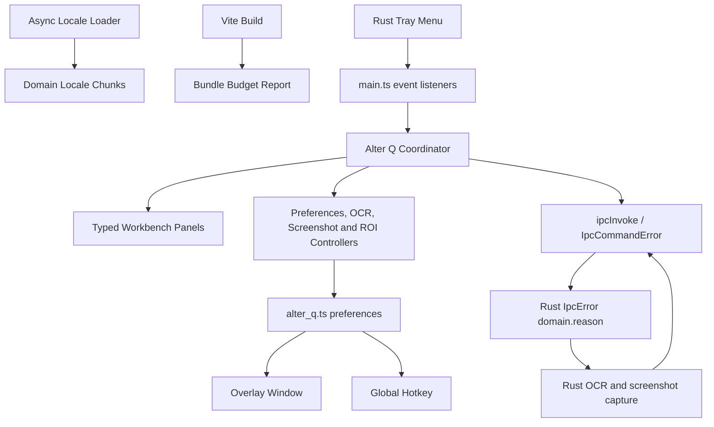

# MxTools Project Context

## Purpose

MxTools is a Windows-focused Tauri + Vue desktop toolbox. Its Apex/Alter Q
workflow reads Steam screenshots with local OCR, calculates launch angles, and
can show a click-through result overlay.

## Architecture

- Frontend: Vue 3, TypeScript, Pinia, Vuetify, Vite.
- Desktop backend: Tauri 2 and Rust under `src-tauri/`.
- IPC wrappers: `src/ipc/commands.ts`; all calls pass through `ipcInvoke`, which
  normalizes native failures as `IpcCommandError`.
- Native IPC errors: `src-tauri/src/ipc_error.rs` defines the serialized
  `domain.reason` contract used by every fallible Tauri command.
- Locale resources: mirrored domain modules under
  `src/i18n/locales/{zh-CN,en-US}/`; `src/i18n/i18n.ts` loads and caches only
  the active locale.
- Alter Q preferences and shared types: `src/types/alter_q.ts`.
- Alter Q coordination, overlay placement, and hotkeys: `src/utils/alter_q.ts`.
- Alter Q workbench coordinator:
  `src/components/game/apex/alter_q/ApexAlterQDialog.vue`; typed setup,
  workspace, OCR, screenshot-source, background, and overlay panels live beside
  it. Controllers and shared screenshot/ROI infrastructure are under
  `src/composables/alter_q/`.
- Overlay window: `src/views/AlterQOverlayView.vue`.
- Tray behavior: `src-tauri/src/tray.rs`; frontend event listeners are in
  `src/main.ts`.
- GitHub Actions release gates are defined in `.github/workflows/ci.yml`.

## Important Workflows

- `openAlterQWindow(target)` in `src/utils/windows.ts` creates or activates the
  Alter Q workbench and navigates to `workspace`, `ocr`, `settings`,
  `background`, or `overlay`.
- The tray exposes direct Workspace, OCR, and Settings entries and sends the
  navigation target to the frontend through the Alter Q open event.
- OCR capture starts from the global hotkey or workbench and calls
  `alter_q_from_latest_screenshot` in Rust.
- Overlay geometry is stored both as legacy logical coordinates and v2
  monitor-relative physical placement to support mixed DPI and multiple screens.
- The screenshot placement dialog refreshes monitor topology while open and
  again before saving, and rejects screenshots whose aspect ratio differs from
  the selected display.
- Preferences can be updated by multiple WebViews. Callers should submit only
  changed fields through `applyAlterQPrefs`.
- Steam screenshot account discovery does not overwrite an intentionally empty
  or manual folder; a default account is applied only during initial setup or
  after the user explicitly selects Steam mode.
- Continuous preference controls coalesce writes while dragging and flush the
  final value when interaction ends.
- Locale activation is asynchronous and last-request-wins. Startup awaits the
  selected locale before mounting Vue; loaded locale chunks remain cached.
- Backend diagnostics stay in IPC `message`/`details`; stable codes drive
  centralized frontend localization and folder-sharing interaction branches.
- Production builds emit a Vite manifest and `dist/bundle-report.json`.
  `scripts/bundle-budget.mjs` enforces startup, per-asset, and aggregate raw/gzip
  limits after every `npm run build`.
- `npm.cmd run "build window release"` builds the NSIS installer and copies the
  installer plus portable executable into `src-tauri/target/release/<version>/`
  with user-facing Chinese filenames. Per-release evidence and remaining manual
  checks are recorded under `docs/RELEASE_CHECKLIST_<version>.md`.

## Constraints

- The worktree has extensive unrelated user changes. Never reset, revert, or
  broadly reformat it.
- Tauri runtime APIs are not available in browser-only tests; keep core
  placement and preference behavior testable with mocks.
- Avoid treating an old Steam screenshot as a fresh hotkey capture.
- Keep root `package-lock.json` and `src-tauri/Cargo.lock` versioned so CI and
  release builds use reproducible dependency resolution.
- Alter Q SFC line limits are enforced by ESLint: coordinator and new panels
  are capped at 700 lines, calibration wrappers at 500.
- Bundle limits are hard gates: startup plus largest locale 525/205 KiB,
  JS chunk 185/68 KiB, CSS asset 270/40 KiB, all JS 1500/525 KiB, and all CSS
  580/105 KiB (raw/gzip).

## Verification

- Frontend lint: `npm.cmd run lint`
- Frontend tests: `npm.cmd test`
- Frontend types/build: `npm.cmd run build`
- Bundle report/check: `npm.cmd run bundle:report` / `npm.cmd run bundle:check`
- Rust formatting: run `cargo fmt --check` from `src-tauri/`
- Rust lint: run `cargo clippy --all-targets -- -D warnings` from `src-tauri/`
- Rust tests: run `cargo test` from `src-tauri/`
- Windows release artifacts: `npm.cmd run "build window release"`
- Whitespace/conflicts: `git -c safe.directory=E:/tauri/mxtools diff --check`

## Current Risks

- OCR and overlay flows span multiple WebViews and native windows, so stale
  async requests, hotplugged monitors, and preference races need explicit
  guards.
- The current UI is responsive but narrow workbench layouts and live monitor
  changes require care when changing menus or placement controls.
- Steam account switching, input-method installation, RDP/firewall changes, SMB
  integration, and mixed-DPI Alter Q placement still require controlled Windows
  machine smoke tests before a public release.

