# MxTools Project Context

## Purpose

MxTools is a Windows-focused Tauri + Vue desktop toolbox. Its APEX Q
workflow reads Steam screenshots with local OCR, calculates launch angles, and
can show a click-through result overlay. Original project material is
source-available under the custom MxTools Noncommercial License 1.0;
noncommercial mirrors and public modified versions are allowed.

## Architecture

- Frontend: Vue 3, TypeScript, Pinia, Vuetify, Vite. Desktop backend: Tauri 2
  and Rust under `src-tauri/`. Browser preview (non-Tauri Vite) mounts Vue with
  native window/system-info IPC skipped; desktop behavior is unchanged.
- IPC wrappers: `src/ipc/commands.ts`; all calls pass through `ipcInvoke`,
  which normalizes native failures as `IpcCommandError`. Native IPC errors:
  `src-tauri/src/ipc_error.rs` defines the serialized `domain.reason` contract
  used by every fallible Tauri command.
- Online account (Beta): `src-tauri/src/online/` signs into apex.0w0.online
  through a browser device-authorization flow; HTTP runs in Rust reqwest
  (`MXTOOLS_ONLINE_API_BASE` overrides the API base for development), the
  `deviceCode` never enters the WebView, and tokens live only in the Windows
  Credential Manager (`MxTools/OnlineAccount`). Error codes use the
  `online_auth.*` / `online_presets.*` domains.
- Locale resources: mirrored domain modules under
  `src/i18n/locales/{zh-CN,en-US}/`; `src/i18n/i18n.ts` loads and caches only
  the active locale. `tests/src/i18n/locale-key-parity.test.ts` enforces
  locale-key parity. The shared toast filter in `src/toast.ts` translates
  structured `i18n.key: detail` errors on every line of a multiline
  notification.
- Shared desktop UI sizing lives in `src/assets/styles/search.css` and
  `src/assets/styles/global.css`: compact tool controls are 28 px, dialog
  actions are 32 px, and standard form fields are 40 px. User-facing `mdi-*`
  icons must be imported and registered in `src/icons/mdi-icons.ts` (the SVG
  icon resolver); an unknown name renders without its declared icon.
- External application protocol actions use the opener URL API; the Tauri
  capability allows only the exact Steam `rungameid`/`validate`/
  downloads-settings/console and Crosshair V2 store URI families plus the two
  Microsoft Store product URIs used by the app.
- The Rust background runtime is coordinated by
  `src-tauri/src/background_coordinator.rs` and
  `src-tauri/src/background_runtime.rs`. `background-runtime.json` is the
  native source of truth for locale, Beta, shared autostart, active Apex Q
  runtime, and Razer state. The native tray stays resident in both interactive
  and `--autostart` modes.
- Installed game discovery: `src-tauri/src/game_scan.rs` runs a user-triggered,
  bounded local scan of Steam/Epic/Xbox manifests and EA/Ubisoft/Battle.net
  registry or local manifests without recursive disk traversal, networking, or
  a resident watcher. User-edited profiles are preserved when a later scan
  refreshes results.
- Accent palettes and their accessible Vuetify color derivation live in
  `src/themes.ts`. APEX red is the default for new or reset preferences.
- `settings.performanceMode` is a persisted, default-off preference that
  disables visible CSS animations/transitions and bypasses theme View
  Transitions. The global reduced-motion rule excludes Vue Toastification's
  progress bar because its `animationend` event is the notification timeout
  clock.
- Apex page coordination lives in `src/pages/game/ApexPage.vue` and
  `src/stores/game/apex/`. All Apex/PUBG apply flows share one running-process
  dialog and one close-then-apply coordinator. Launcher reads use one
  quote-aware token classifier for both managed selections and the custom
  remainder: only complete supported command/value sequences are claimed, while
  `+exec` and its next argument are protected from catalog matching.
- Miles one-click downloads use the local Steam/EA CEF clients in
  `src-tauri/src/game/apex_language_download{,_ea}.rs`, share one native
  progress gate whose `apex-miles-download-progress` event is restored by
  `actions_miles.ts`, and only restart a client after its running-game check
  passes.
- Apex quick presets run in the independent `/apex-quick-preset` Tauri WebView
  with the shared `VMain + AppTopBar` shell; the `apex-quick-preset-window`
  label must remain in the shared Tauri capability so its event listeners and
  title-bar window APIs can initialize.
- When `settings.cfg` is missing, contains no bindings, or contains only the
  three bindings created by the old incomplete bootstrap path, the Rust
  mutation boundary initializes the document from the embedded current-build
  default template (`src-tauri/src/game/apex_defaults.rs`, verified against the
  current game build) before applying binding mutations, so a
  partial or absent file gains the complete default binding set; the
  initialization is recorded in the same history transaction. With a valid
  baseline, bindings apply in two explicit phases: remove selected target
  inputs, duplicate physical inputs, and duplicate action/context slots, then
  create the new bindings from an existing template or an allowlisted direct
  command. Mutation order therefore contains all deletes before creates.
- Apex startup repair is Beta-gated and runs in the independent
  `/repair-apex-launch` WebView; `src-tauri/src/game/apex_launch_repair.rs`
  owns install discovery, log classification, the action allowlist, the repair
  mutex, and one-UAC administrator batching. Configuration reset reuses Apex
  history transactions and verified rollback.
- The Apex game-setting catalog mirrors the in-game Gameplay, HUD,
  Accessibility, and Privacy groups alongside the aiming, binding, controller,
  and audio groups. Runtime-observed encodings and confirmed numeric ranges are
  recorded in `docs/APEX_GAME_SETTINGS_RUNTIME_MAPPING.md`.
- Apex history and configuration transactions are implemented by
  `src-tauri/src/game/apex_history.rs`, exposed through typed wrappers in
  `src/ipc/commands.ts`, and adopted by `src/stores/game/apex/actions_history.ts`.
  Internal history is separate from the public snapshot format.
- Remote Desktop coordination lives in `src/pages/windows/RemoteDesktopPage.vue`
  and `src/stores/rdp.ts` / `src/stores/windows_user.ts`. Windows repair tools
  live in `src/pages/windows/AppRepairPage.vue` and
  `src-tauri/src/app_repair.rs`. Network repair lives in
  `src/pages/windows/NetworkRepairPage.vue` and
  `src-tauri/src/network_repair.rs`.
- APEX Q preferences and shared types: `src/types/apex_q.ts`; all storage,
  window, route, event, IPC command, and error-code contracts use the
  `apex-q` / `apex_q` namespace. Coordination, overlay placement, and hotkeys:
  `src/utils/apex_q.ts`; workbench coordinator:
  `src/components/game/apex/apex_q/ApexQDialog.vue`; controllers under
  `src/composables/apex_q/`; overlay window: `src/views/ApexQOverlayView.vue`;
  tray behavior: `src-tauri/src/tray.rs`; frontend event listeners:
  `src/main.ts`.
- `settings.betaFeaturesEnabled` is the persisted, default-off feature gate for
  in-development UI. APEX Q, Game Checkup, Razer polling rate, LAN sharing,
  Remote Desktop, Input Method, and Explorer context-menu management are
  currently behind this gate; gated tools are removed from navigation,
  dashboard, command search, category indexes, shortcuts, tray entries, and
  direct main-window routes as applicable.
- GitHub Actions release gates are defined in `.github/workflows/ci.yml`. The
  Rust job pins the GitHub mirror revision of the external `windows_tool` path
  dependency because `Cargo.lock` does not record a Git revision for path
  packages; dependency upgrades must sync that mirror and advance the pin. The
  job restores Cargo registry and dependency build artifacts from a
  toolchain/manifest-aware cache for `src-tauri/target`; only `master` saves
  entries, including warmed artifacts from failed runs.
- The proposed, not-yet-implemented online updater design is documented in
  `docs/TAURI_ONLINE_UPDATE_PLAN.md`; it keeps GitHub as the authoritative
  release source and requires explicit runtime fallback rather than treating
  the proposal as current application behavior.
- Licensing scope is defined by root `LICENSE`, `NOTICE`, and
  `THIRD_PARTY_NOTICES.md`. The APEX Q calculation port is used under
  project-specific written permission granted by the upstream author on
  2026-06-13, with attribution; the maintainer retains the original Bilibili
  private-message evidence.

## Important Workflows

- `openApexQWindow(target)` in `src/utils/windows.ts` creates or activates the
  APEX Q workbench and navigates to `workspace`, `ocr`, `settings`,
  `background`, or `overlay`. The tray exposes direct Workspace, OCR, and
  Settings entries and sends the navigation target to the frontend through the
  APEX Q open event.
- OCR capture starts from the global hotkey or workbench and calls
  `apex_q_from_latest_screenshot` implemented in `src-tauri/src/game/apex_q.rs`.
  OCR/model downloads use Reqwest streaming over the Windows SChannel TLS stack;
  downloaded files retain SHA-256 verification and progress events without
  statically linking Rustls into the Windows release executable.
- Long-lived UI preferences are stored in the persisted `settings` Pinia store
  (`@tauri-store/pinia`). Web Storage (`localStorage`/`sessionStorage`) is
  prohibited throughout production code; persist frontend state through Pinia
  stores backed by `@tauri-store/pinia`, and send transient cross-window
  updates through Tauri events or native IPC rather than a persistence layer.
- Apex launch, video, and game-setting writes record their pre-change state
  under the global history mutex. Quick presets and snapshot imports use one
  `mutate_apex_config` transaction so their scopes share a transaction ID and
  any failed file write rolls the affected files back. Rollback is verified;
  when it cannot be proven complete, the recovery history is retained instead
  of being discarded. Repeated writes to one scope in the same transaction do
  not delete the transaction's original undo state.
- Editable Apex keyboard/mouse actions render as two binding slots. Frontend
  slots map to the real config contexts `0` and `1`, and drafts become explicit
  create/update/delete mutations. The Rust writer keeps adjacent held bindings
  paired, rejects duplicate or third slots, and validates global input
  uniqueness before writing. The observed Apex settings file also contains
  lowercase `+weaponcycle`, spectator utility commands, and numbered controller
  `+ability`/`+ability_held` pairs; keyboard/mouse commands are editable while
  doubled bracket tokens emitted by some Apex configs are normalized to their
  single-key `[`/`]` form when loaded and repaired on the next binding write.
  Controller-button inputs remain read-only. Keyboard capture accepts the
  observed `KP_INS`, `KP_ENTER`, `NUMLOCK`, and `SCROLLLOCK` names.
- Apex configuration snapshots use the version-1 JSON shape while export and
  import controls classify backend-supported keys into other game settings,
  keyboard/mouse aiming and sensitivity, controller settings and sensitivity,
  and bindings. Export loads only selected sources; import starts from the last
  clean disk report rather than an unsaved draft, and binding import reconciles
  the complete selected two-slot topology with create/update/delete mutations,
  including an explicit empty binding list that clears all editable bindings.
  Snapshot value validation includes the documented packed RGB range
  `0..16777215`, so a valid persisted laser-sight color does not reject the
  whole export. Snapshot parsing rejects launch-option control characters and
  invalid values for known game-setting keys before calling native mutation
  APIs.
- Snapshot import/export always excludes machine-local audio endpoint IDs
  `miles_output_device` and `voice_input_device`, and excludes the Apex-managed
  video key `setting.configversion` in both directions.
- Snapshot Vitest automation covers timestamped export-to-import round trips,
  version rejection, serialized export filtering, keyboard/mouse versus
  controller import isolation, and an actual temporary-directory file write
  followed by disk read and snapshot parsing. All standalone tests live under
  the root `tests/` directory: Vitest files use mirrored `tests/src/...` and
  `tests/scripts/...` paths, while external Rust unit modules live under
  `tests/rust/src-tauri/...` and are mounted by minimal test-only `include!`
  blocks placed after every other item in their owning modules so clippy
  `items_after_test_module` stays clean.
- Apex history is stored under Tauri `app_data_dir/apex-history/v1` with raw
  bytes, missing-file state, read-only attributes, SHA-256 checksums,
  versioned metadata, and 30 entries per stream. Launch history is isolated
  per Steam/EA account; video and game-setting history is machine-wide.
  Existing `.mxtools.bak` game-setting files are fingerprinted and imported
  once without being removed; a migration marker is written before internal
  backups can be mistaken for later legacy imports.
- Apex video mutations accept only the keys owned by
  `src/data/apex_video_config.ts`, with key-specific enum, integer, and finite
  numeric ranges enforced in Rust. Unknown `setting.*`, including
  `setting.configversion`, and quoted or control-character keys and values are
  rejected before no-op detection. Steam, EA, and unified launch-option writes
  reject control characters before history is mutated. Laser custom colors use
  `R + (G << 8) + (B << 16)`.
- Apex-only reset clears launch options for the selected account after
  recording history, then writes `videoconfig.txt`, `settings.cfg`, and
  `profile.cfg` from the embedded current-build default templates
  (`src-tauri/src/game/apex_defaults.rs`). Video quality uses the generic
  default ladder; display resolution is taken from the current video file so
  the monitor size is not changed. The frontend reloads video and game
  settings immediately after reset. Every history restore records the current
  state first so the restore is undoable.
- `npm.cmd run "tauri dev"` uses `scripts/tauri-dev.mjs` as a Windows
  single-instance development launcher: it removes only process trees proven to
  belong to this worktree, refuses to terminate an unknown owner of fixed Vite
  port 14200, and then invokes the repository-local Tauri CLI.
- Route pages are lazily imported. `vite.config.ts` warms the entry, views,
  pages, and shared navigation chrome at dev startup to keep that work off the
  interaction path. `css.preprocessorOptions` is a top-level option and has no
  effect nested under `server`.
- Production frontend builds emit a Vite manifest and
  `dist/bundle-report.json`. The default `npm run build` records startup,
  per-asset, and aggregate raw/gzip sizes without failing on budget overruns;
  `npm run bundle:check` remains an optional strict diagnostic.
- `npm.cmd run "build window release"` is the single Windows release entry
  point. The portable and normal installer must remain strictly below
  5,000,000 bytes; the offline-WebView2 store build is exempt from that
  compact-build limit. Per-release evidence and remaining manual checks are
  recorded under `docs/RELEASE_CHECKLIST_<version>.md`. With no Authenticode
  budget, external EXE/NSIS artifacts remain explicitly unsigned and must not
  be presented as a trusted publisher build; the release notes state that and
  carry SHA-256 values.

## Constraints

- The worktree has extensive unrelated user changes. Never reset, revert, or
  broadly reformat it.
- Tauri runtime APIs are not available in browser-only tests; keep core
  placement and preference behavior testable with mocks.
- New or changed standalone frontend, script, and Rust test code belongs under
  the root `tests/` directory. Frontend and script tests mirror production
  paths; external Rust unit modules live under `tests/rust/` and are included
  from the end of their owning modules when private access is required. Feature
  coverage uses a focused test file instead of expanding an omnibus test;
  existing broad tests are migrated when their covered behavior changes, not
  through unrelated bulk churn.
- Keep user-facing data labels as locale keys rather than embedding Chinese or
  English strings in configuration arrays. Numeric values, units, and product
  names may remain literal.
- Reset and internal configuration history are Apex-only. Do not extend them to
  PUBG or other tools without a separate product decision.
- Only expose an Apex game-setting enum when its config key, complete value
  mapping, and labels have been verified. Unconfirmed in-game controls remain
  visible under the read-only unknown-key section until that evidence exists.
- Do not run reset or restore smoke tests against a user's real Steam/EA Apex
  configuration without explicit authorization; backend tests must use isolated
  temporary files.
- Do not automate, control, or navigate the live Apex client for runtime
  mapping. Any future in-game selection must be performed manually by the user;
  tooling may only take read-only before/after config copies and compare them.
- Do not run Microsoft Store reset/re-registration, OneDrive reset/install, or
  service-changing Application Repair smoke tests on the host without explicit
  authorization. Browser visual QA must use deterministic mocked IPC; source
  tests cover action validation without changing the machine.
- Do not run Apex/EAC process termination, cache deletion, driver handling,
  EAC repair, or DISM/SFC through the repair IPC on a development machine.
  Native tests use path fixtures and action validation; Steam/EA acceptance is
  a separate controlled Windows run.
- Avoid treating an old Steam screenshot as a fresh hotkey capture.
- Keep root `package-lock.json` and `src-tauri/Cargo.lock` versioned so CI and
  release builds use reproducible dependency resolution.
- APEX Q SFC line limits are enforced by ESLint: coordinator and new panels
  are capped at 700 lines, calibration wrappers at 500.
- Bundle size budgets remain visible in `dist/bundle-report.json` and through
  the optional `npm run bundle:check` diagnostic, but they are not default
  frontend build gates.
- Mirrors and modified releases are allowed only for noncommercial purposes and
  must preserve the complete MxTools license plus all `Required Notice:` lines.
  Third-party software, game, platform, and brand icons remain under their
  respective owners' copyright, trademark, and other intellectual-property
  rights; their display identifies the corresponding product or service and
  does not imply affiliation or endorsement.

## Verification

- Frontend lint: `npm.cmd run lint`
- Frontend tests: `npm.cmd test`
- Frontend types/build and bundle report: `npm.cmd run build`
- Optional strict bundle diagnostic: `npm.cmd run bundle:check`
- Rust formatting: run `cargo fmt --check` from `src-tauri/`
- Rust type/build check: run `cargo check` from `src-tauri/`
- Rust lint: run `cargo clippy --all-targets -- -D warnings` from `src-tauri/`
- Rust tests: run `cargo test` from `src-tauri/`
- Windows release artifacts: `npm.cmd run "build window release"`
- Release artifact size gate: `npm.cmd run release:size:check`
- Whitespace/conflicts: `git diff --check`
- Razer pure protocol tests: `cargo test razer_polling` from `src-tauri/`.
  The ignored `hardware_probe_reads_the_current_rate_without_writing` test is
  an explicit read-only device gate; it must not be used as evidence of a
  completed frequency change. The separately ignored
  `hardware_switches_1000_to_500_and_restores_1000` test is the explicit
  reversible device gate: it requires a 1000 Hz baseline and validates GET
  readback after both the switch and restoration.

## Current Risks

- A real Razer SET/restore gate remains a separately authorized hardware test;
  this source verification did not execute it. Keep feature-report selection
  constrained to the verified `MI_03` interface and retain the
  no-SET-after-failed-GET latch for unplugged, sleeping, or nonresponsive
  receivers. The read-only discovery path and reversible fixture tests are the
  current evidence for the protocol layer.
- OCR and overlay flows span multiple WebViews and native windows, so stale
  async requests, hotplugged monitors, and preference races need explicit
  guards.
- The borderless Tauri window cannot be reliably pixel-captured by the current
  Windows automation stack (`SetIsBorderRequired` may return `0x80004002`).
  Release UI checks should include the real desktop app at 100% and 125%
  display scaling, especially search controls, segmented buttons, loading
  states, and icon-only buttons.
- Steam account switching, input-method installation, RDP/firewall changes,
  Microsoft-account source detection, dedicated RDP account creation/rollback,
  SMB integration, and mixed-DPI APEX Q placement still require controlled
  Windows machine smoke tests before a public release.
- Microsoft Store package registration/reset, UAC-batched service recovery,
  OneDrive reset/restart, and post-reboot `CldFlt` verification still require a
  controlled Windows machine smoke test before release.
- Full Apex reset, launcher-running rejection, game-generated defaults, and the
  31st-entry retention boundary still require controlled Steam and EA smoke
  tests in addition to the isolated Rust and Vitest coverage.
- Steam and EA install discovery, real EAC repair/UAC behavior, driver
  recovery, restart messaging, and the Apex repair window at 100%/125% scaling
  still need controlled Windows acceptance before release.
- Portable payload caches are version-scoped and intentionally not auto-pruned,
  so an old `%LOCALAPPDATA%/mxtools/portable-cache/<version>` directory remains
  until the user removes it; this avoids breaking an older portable build that
  may still be in use.
- The store-oriented NSIS artifact contains the Microsoft-signed x64 WebView2
  offline installer and is therefore about 200 MB. It is still an unsigned app
  artifact until the publisher signing and Microsoft Store submission steps are
  completed.
- `src-tauri/src/game/apex_theta.rs` is a close Rust port of
  `NYTN02/APEX_thetacalculation`. Its inspected upstream commit has no general
  license, so reuse outside MxTools is not authorized by this repository; the
  MxTools port relies on the project-specific written permission recorded in
  `THIRD_PARTY_NOTICES.md`.

```mermaid
graph TD
  Workbench["APEX Q Coordinator"] --> Panels["Typed Workbench Panels"]
  Workbench --> Controllers["Preferences, OCR, Screenshot and ROI Controllers"]
  Controllers --> Prefs["apex_q.ts preferences"]
  Workbench --> IPC["ipcInvoke / IpcCommandError"]
  IPC --> Contract["Rust IpcError domain.reason"]
  Contract --> Rust["Rust OCR and screenshot capture"]
  LocaleLoader["Async Locale Loader"] --> LocaleChunks["Domain Locale Chunks"]
  LocaleChunks --> LocaleParity["Locale and Apex Preset Parity Tests"]
  UITokens["Compact 28 / Dialog 32 / Form 40 px"] --> ApexUI["Apex Toolbars, Filters and Editors"]
  ApexUI --> NarrowFilters["Launch / Video Filters Wrap at 560 px"]
  UITokens --> GameActions["Game Bottom Actions Stack at 560 px"]
  GameActions --> HistoryAria["History / Reset ARIA Labels"]
  ContextMenu["Context Menu Manager"] --> ContextMenuControls["Compact Search / Scope / Refresh"]
  UITokens --> ContextMenuControls
  UITokens --> TopBar["Title-bar Search Trigger"]
  Themes["Accent Palettes / APEX Red Default"] --> Vuetify["Accessible Light and Dark Colors"]
  Themes --> StartupChrome["Splash and Tray Tooltip Fallbacks"]
  Settings["Persisted Settings"] --> BetaGate["Beta Features Gate"]
  BetaGate --> BetaEntries["APEX Q and Untested Tool Entries"]
  ApexPage["Apex Page Coordinator"] --> ApexStore["Cached Load State Machines"]
  PubgPage["PUBG Launch Page"] --> PubgOptions["Launch Options / Compact Account Toolbar"]
  PubgOptions --> IPC
  ApexStore --> IPC
  ApexStore --> HistoryUI["History and Reset Dialogs"]
  HistoryUI --> HistoryIPC["Mutation, List, Restore and Reset IPC"]
  HistoryIPC --> HistoryEngine["Rust History Mutex and Rollback"]
  HistoryEngine --> HistoryDisk["app_data_dir/apex-history/v1"]
  HistoryEngine --> ApexFiles["Launch Options and Apex Config Files"]
  RDPPage["Remote Desktop Host / Client Workspace"] --> RDPStore["RDP Store / One Page Refresh"]
  RDPPage --> RDPAccounts["SID-backed Account Source / Access Setup"]
  RDPAccounts --> UserStore["Windows User Store / Latest Request Wins"]
  RDPStore --> IPC
  UserStore --> IPC
  RepairCatalog["Repair Tools Catalog"] --> AppRepairPage["Store / OneDrive Independent Windows"]
  RepairCatalog --> IconRepairWindow["Blank Icon Independent Window"]
  RepairCatalog --> ApexLaunchRepairPage["Apex Launch Repair Window"]
  ApexPage --> ApexLaunchRepairPage
  ApexLaunchRepairPage --> ApexLaunchRepairNative["Ten Diagnostics / Allowlisted Repair Batch"]
  ApexLaunchRepairNative --> HistoryEngine
  ApexLaunchRepairNative --> UACBatch
  IconRepairWindow --> WindowsShell["Current-session Icon Cache Repair"]
  AppRepairPage --> AppRepairIPC["Per-check Diagnostics and Whitelisted Repairs"]
  AppRepairIPC --> AppRepairNative["Package, Service, Policy and Process Checks"]
  AppRepairNative --> UACBatch["Single UAC Batch for Administrator Repairs"]
  NetworkRepairPage["Network Repair Page"] --> NetworkRepairNative["Proxy / WinINET / WinHTTP / DNS / Adapter Diagnostics"]
  NetworkRepairNative --> NetworkRepairActions["Allowlisted repair actions with confirmation"]
  Build["Vite Build"] --> Budget["Bundle Budget Report"]
  Build --> ReleaseOrchestrator["Three-artifact Windows Release"]
  ReleaseOrchestrator --> CompactInstaller["Compact NSIS < 5 MB"]
  ReleaseOrchestrator --> CachedPortable["Cached Portable < 5 MB"]
  ReleaseOrchestrator --> StoreInstaller["Offline WebView2 Store NSIS"]
  Prefs --> Overlay["Overlay Window"]
  Prefs --> Hotkey["Global Hotkey"]
  Tray["Rust Tray Menu"] --> Main["main.ts event listeners"]
  Main --> Workbench
  RazerPollingPage["Razer Polling Beta Page"] --> RazerPollingControl["Manual / Foreground Auto Control"]
  RazerPollingControl --> IPC
  IPC --> RazerPollingNative["Verified Protocol 2.5 HID Transactions"]
  Rust --> IPC
  BrowserPreview["Non-Tauri Vite Preview"] --> PreviewGuards["Runtime Guards / Truthful Empty States"]
  PreviewGuards --> Router["Hash Router"]
  PreviewGuards --> TopBar
  PreviewGuards --> GameCheckup["Game Checkup Preview"]
  PreviewGuards --> RazerPollingPage
  PreviewGuards --> WindowsOverview["Windows Overview Preview"]
```

