# MxTools Project Context

## Purpose

MxTools is a Windows-focused Tauri + Vue desktop toolbox. Its APEX Q
workflow reads Steam screenshots with local OCR, calculates launch angles, and
can show a click-through result overlay. Original project material is
source-available under the custom MxTools Noncommercial License 1.0;
noncommercial mirrors and public modified versions are allowed.

## Architecture

- EA Apex quick launch uses `start_apex_ea` IPC and native Windows COM in
  `game/apex_launch_ea.rs`. A dedicated STA thread locates Explorer's existing
  desktop through `IShellWindows` / `IShellBrowser`, obtains `IDispatch` from
  the background view, and queries `IShellFolderViewDual` / `IShellDispatch2`.
  It invokes installed EALauncher with `origin://launchgame/194908`, show mode 7,
  passing UTF-16 paths as separate COM values. Interfaces drop before the
  apartment is uninitialized. No PowerShell child process is used for launch.
  Direct game launch and a standalone Shell object previously reproduced EA
  CreateProcess access-denied errors; retain Explorer as the launch broker.
  The native desktop lookup passed a read-only interactive Windows test, and
  the user confirmed EA start/exit without a new alert. Steam uses its existing URI.

- Frontend: Vue 3, TypeScript, Pinia, Vuetify, Vite. Desktop backend: Tauri 2
  and Rust under `src-tauri/`. Browser preview (non-Tauri Vite) mounts Vue with
  native window/system-info IPC skipped; desktop behavior is unchanged.
- IPC wrappers: `src/ipc/commands.ts`; all calls pass through `ipcInvoke`,
  which normalizes native failures as `IpcCommandError`. Native IPC errors:
  `src-tauri/src/ipc_error.rs` defines the serialized `domain.reason` contract
  used by every fallible Tauri command.
- Online account (Beta): `src-tauri/src/online/` signs into apex.0w0.online
  through a browser device-authorization flow; HTTP runs in Rust reqwest
  (`MXTOOLS_ONLINE_API_BASE` overrides the API base for development), the
  `deviceCode` never enters the WebView, and tokens live only in the Windows
  Credential Manager (`MxTools/OnlineAccount`). Error codes use the
  `online_auth.*` / `online_presets.*` domains.
- Locale resources: mirrored domain modules under
  `src/i18n/locales/{zh-CN,en-US}/`; `src/i18n/i18n.ts` loads and caches only
  the active locale. `tests/src/i18n/locale-key-parity.test.ts` enforces
  locale-key parity. The shared toast filter in `src/toast.ts` translates
  structured `i18n.key: detail` errors on every line of a multiline
  notification.
- Shared desktop UI sizing lives in `src/assets/styles/search.css` and
  `src/assets/styles/global.css`: compact tool controls are 28 px, dialog
  actions are 32 px, and standard form fields are 40 px. User-facing `mdi-*`
  icons must be imported and registered in `src/icons/mdi-icons.ts` (the SVG
  icon resolver); an unknown name renders without its declared icon.
- Apex, PUBG and the independent Apex quick-preset window share
  `components/game/common/GameTipDialog.vue` and `GameTipCard.vue` for setting
  explanations. Dialogs use a 720 px width bounded by 16 px viewport margins;
  the title and 32 px close action remain fixed while descriptions and media
  scroll together. Platform wrappers only bind their store's close action.
  Do not let individual tips or the general VDialog defaults determine width.
  Tip video frames keep a 16:9 ratio; galleries bound their preview height and
  reserve each image's aspect ratio before lazy loading to keep anchors stable
  (update these ratios when replacing gallery assets). Long action labels wrap.
  Hover tips (Vuetify and native-title replacements)
  share compact typography and a 320 px width limit, except game-version build
  identities, which stay on one line; native-title positioning uses untransformed
  layout dimensions and clamps both axes to the viewport.
- All five Toastification notification types share a uniform thin border with
  no side stripe. Their surface, text, and icon colors use the global toast
  tokens, with dark overrides on `html.dark` for body-mounted notifications.
  The subtle bottom progress bar remains the notification dismissal clock.
- External application protocol actions use the opener URL API; the Tauri
  capability allows only the exact Steam `rungameid`/`validate`/
  downloads-settings/console and Crosshair V2 store URI families plus the two
  Microsoft Store product URIs used by the app.
- The Rust background runtime is coordinated by
  `src-tauri/src/background_coordinator.rs` and
  `src-tauri/src/background_runtime.rs`. `background-runtime.json` is the
  native source of truth for locale, Beta, shared autostart, active Apex Q
  runtime, and Razer state. The native tray stays resident in both interactive
  and `--autostart` modes.
- Installed game discovery: `src-tauri/src/game_scan.rs` runs a user-triggered,
  bounded local scan of Steam/Epic/Xbox manifests and EA/Ubisoft/Battle.net
  registry or local manifests without recursive disk traversal, networking, or
  a resident watcher. User-edited profiles are preserved when a later scan
  refreshes results.
- Accent palettes and their accessible Vuetify color derivation live in
  `src/themes.ts`. APEX red is the default for new or reset preferences.
- `settings.performanceMode` is a persisted, default-off preference that
  disables visible CSS animations/transitions and bypasses theme View
  Transitions. The global reduced-motion rule excludes Vue Toastification's
  progress bar because its `animationend` event is the notification timeout
  clock.
- Apex page coordination lives in `src/pages/game/ApexPage.vue` and
  `src/stores/game/apex/`. All Apex/PUBG apply flows share one running-process
  dialog and one close-then-apply coordinator. Launcher reads use one
  quote-aware token classifier for both managed selections and the custom
  remainder: only complete supported command/value sequences are claimed, while
  `+exec` and its next argument are protected from catalog matching.
  Simplified-reticle selection uses the classifier's recognized state for both
  Steam's quoted space-separated RGB and EA's hyphen-separated RGB. Reopen
  tests cover every quick-preset optimization individually and all together
  on both launchers, including two fresh-store launch serialization round trips.
  Platform differences and required regression coverage are listed explicitly
  in `docs/APEX_CONFIG_ALIGNMENT.md`: launcher files/accounts and process checks
  differ; reticle delimiters and FOV quoting differ. Catalog literals use Steam
  spelling, so they cannot alone identify EA readback selections.
- Apex letterbox launch options manage only min/goal. The minimum is clamped
  to 1-2; omitted values use the game defaults 1.59/1.6, while quick presets
  use a minimum of 1. Retired threshold tokens remain in custom launch input.
- Apex/PUBG action footers share `GameVersionStatus.vue`, backed by the
  read-only `get_installed_game_version` IPC. Steam manifests identify the
  installation and build; Apex also reads gameversion.txt/build.txt and selects
  EA's installation from the active account when applicable. PUBG displays the
  installed Steam Build ID, not a guessed marketing patch number. Exact verified
  build identities live in `src/utils/game/version_support.ts`; unknown and
  unverified builds remain distinct. No PUBG build is marked verified yet.
  Version reads refresh on target changes and window focus, with stale responses
  ignored. This is an advisory indicator, not an application-blocking gate.
- Miles one-click downloads use the local Steam/EA CEF clients in
  `src-tauri/src/game/apex_language_download{,_ea}.rs`, share one native
  progress gate whose `apex-miles-download-progress` event is restored by
  `actions_miles.ts`, and only restart a client after its running-game check
  passes.
- Download management lives at `/downloads`, above Settings in navigation.
  Clicking the navigation entry first opens an anchored compact queue popover
  without leaving the current page. Its expand icon opens `/downloads`.
  `components/downloads/DownloadJobList.vue` owns task rendering and launcher
  stop confirmations for both surfaces; queue/history tabs and scrollable rows
  live in `DownloadQueuePopover.vue`. Popover visibility is transient local UI
  state, closes on outside click/Escape/navigation, and does not affect workers.
  The navigation icon shows a determinate ring for known active transfer
  progress, an indeterminate ring for other active phases, and distinct queued,
  paused, and failed states even when the sidebar is collapsed.
  `game/download_manager.rs` owns the session-wide serial Steam/EA queue,
  task identity and revisioned event snapshots; the frontend downloads store
  does not persist those transient events. Pause/cancel of an active task
  explicitly confirms exiting its launcher, retains downloaded files and waits
  for worker acknowledgement. Resume resubmits to the launcher for reuse.
  History is session-only, bounded, and is not evidence that files still exist.
  Reopening the Miles dialog discards stale terminal state and forces a file
  check. Both workers check audio availability before reporting completion.
  Steam's console flow polls `download_sources` for completed chunks and tails
  only new `content_log.txt` records for the requested depot's chunk total.
  `steam_download_progress.rs` rejects overlapping transfers, regressing/out-of-range
  counters and unreadable/truncated logs, leaving those cases indeterminate.
  UI percentages explicitly count chunks, not bytes or preallocated file sizes;
  100% still requires correlated completion and successful file application.
  `app_update_status` and the Downloads overview do not track console depot jobs.
  EA uses known byte progress when available and reports language-restore errors.
  EA destination jobs carry their selected `eaUserId`. With Steam installed,
  they prefer the Steam depot transport in `ea_steam_voice.rs`, including chunk
  progress, then stage and copy only the requested voice pair to EA's audio
  directory without changing EA language. `sourcePlatform` identifies transport
  separately from destination; cancellation stops Steam for these EA jobs.
  Steam failures remain explicit rather than silently triggering EA verification.
  Without Steam (or when an interrupted native EA language restore is pending),
  the EA bridge remains the native route; restore state is account-scoped.
  EA audio discovery in the local `windows_tool` dependency validates Respawn's
  machine installation registry (both views) before the account's default download
  folder. A candidate requires an Apex executable and `audio/ship`; the account
  preference alone is not evidence of the installed location.
- Advanced video input ranges are separate from game-menu endpoints. The
  texture budget has distinct runtime and serialized ladders. CSM coverage
  starts at 1; disabling uses csm_enabled, not coverage=0. The 128/256 CSM
  fields remain advanced choices, with a separate 512-minimum atlas calculation.
  Full consumer-side extrema for model extensions remain unverified.
- Apex quick presets run in the independent `/apex-quick-preset` Tauri WebView
  with the shared `VMain + AppTopBar` shell; the `apex-quick-preset-window`
  label must remain in the shared Tauri capability so its event listeners and
  title-bar window APIs can initialize. Controls are grouped by their write
  target: launcher config (including FPS caps), `videoconfig.txt` (including
  graphics presets), `profile.cfg`, and `settings.cfg` bindings. The shared
  resolution/aspect control explicitly identifies both launcher and video files.
  Minimal sprint view shake selects `sprint_view_shake_style=1`; the game reset
  remains Normal (`0`). The right-mouse hold-aim preset matches only `+zoom`
  and replaces `+toggle_zoom` on that input instead of preserving toggle mode.
  Reset keeps the game's original right-mouse `+toggle_zoom` binding, so both
  quick-preset options are unchecked after resetting to game defaults.
  Quick-preset video writes are limited to the fields selected in that session.
  Successful native writes adopt the returned disk state before verification;
  readback or read-only protection failures keep the window open and notify
  other windows of changed scopes without a success notification. Failed
  refreshes cannot reuse cached game settings, and duplicate submissions are
  rejected. Focused workflow tests cover Steam/EA and post-write failures.
  Video writes and read-only locking require `setting.configversion >=10`
  within positive signed int32. Current J57 loads versions >=7, but 7-9 still
  read legacy map-detail/SSAO fields; a positive version alone is insufficient.
  This checks field compatibility, not completeness. Reset followed by
  an immediate preset previously created and locked an incomplete video file,
  which passed key-value readback despite the user's EA menu retaining defaults.
  Missing/versionless and legacy-format files remain pending on reopening.
  The explicit `prepare_apex_video_config_regeneration` action backs up and
  removes only an incomplete or legacy-format video file under the history mutex.
  Its UI states that regeneration resets video preferences. It rejects a
  running game or a file already regenerated, and leaves launch options,
  settings and profile alone. This optional game-regeneration action still
  requires launching Apex. Full reset instead initializes all three files
  immediately, so presets can be applied without an intervening game launch.
  Both platforms share this machine-wide rule.
  Native video integration tests run frontend selection through the production
  Rust reader/writer in child processes with isolated USERPROFILE directories;
  they cover all ten video toggles individually and together on Steam/EA with
  two fresh-store reads. Fixtures contain all 42 current serialized fields plus
  an unknown field and verify preservation of every unedited key. A second
  integration suite runs real reset transactions, video/profile/binding writes,
  two fresh-store reads, and another reset; only launcher storage is a fixture.
  Its all-selected case checks platform option recognition; the reopen suite
  separately checks exact reticle/FOV spelling. These tests do not replace
  user-controlled in-game acceptance. Product format and reset requirements are
  in `docs/APEX_VIDEO_CONFIG_FORMAT.md`. Hardware-dependent defaults cannot be
  replaced by a universal mid-quality template.
- When `settings.cfg` is missing, contains no bindings, or contains only the
  three bindings created by the old incomplete bootstrap path, the Rust
  mutation boundary initializes the document from the embedded current-build
  default template (`src-tauri/src/game/apex_defaults.rs`, verified against the
  current game build) before applying binding mutations, so a
  partial or absent file gains the complete default binding set; the
  initialization is recorded in the same history transaction. Mutations that
  were drafted against an empty or legacy three-binding document are rebased
  onto the new template by action/held-command identity. If the template has
  only the opposite aim mode, rebasing creates the requested command explicitly;
  hold and toggle modes remain distinct. With a valid baseline, bindings apply
  in two explicit phases: remove selected target inputs, duplicate physical inputs, and
  duplicate action/context slots, then create the new bindings from an
  existing template or an allowlisted direct command. Mutation order
  therefore contains all deletes before creates.
  Manual binding edits take over an occupied editable input across both slots:
  the previous binding is cleared in the draft and deleted in the same apply
  request. Non-editable bindings remain protected from reassignment.
  The first binding-button click starts recording; the next left click on that
  button records MOUSE1 on click, preventing its trailing click from restarting
  capture. Clicking another interactive control exits capture without binding it.
- Apex startup repair is Beta-gated and runs in the independent
  `/repair-apex-launch` WebView; `src-tauri/src/game/apex_launch_repair.rs`
  owns install discovery, log classification, the action allowlist, the repair
  mutex, and one-UAC administrator batching. Configuration reset reuses Apex
  history transactions and verified rollback.
- The Apex game-setting catalog mirrors the in-game Gameplay, HUD,
  Accessibility, and Privacy groups alongside the aiming, binding, controller,
  and audio groups. Runtime-observed encodings and confirmed numeric ranges are
  recorded in `docs/APEX_GAME_SETTINGS_RUNTIME_MAPPING.md`.
  The catalog supports weapon dialogue as a single 0/1 profile key,
  and accessible-chat navigation as the four values 0/1/2/3 (Off / Hint Text /
  Voice Narration / Text and Voice); the latter is visible under the game's
  English-language condition. Rust must accept all four values, not treat it
  as a boolean. `ps5_force_enable_adth` is a consumed initialization flag,
  separate from the editable vibration and trigger preferences, and is excluded
  from Review later. The other 18 unowned keys remain read-only with localized,
  searchable compatibility notes. Unknown keys and same-name keys in other files
  remain visible. Writes to cl_safearea and hudchat_visibility accept canonical
  0/1; reading or editing another key preserves noncanonical existing values.
  See `docs/APEX_SETTINGS_REVIEW_AUDIT.md` for the product handling rules.
- Apex history and configuration transactions are implemented by
  `src-tauri/src/game/apex_history.rs`, exposed through typed wrappers in
  `src/ipc/commands.ts`, and adopted by `src/stores/game/apex/actions_history.ts`.
  Internal history is separate from the public snapshot format.
- Remote Desktop coordination lives in `src/pages/windows/RemoteDesktopPage.vue`
  and `src/stores/rdp.ts` / `src/stores/windows_user.ts`. Windows repair tools
  live in `src/pages/windows/AppRepairPage.vue` and
  `src-tauri/src/app_repair.rs`. Network repair lives in
  `src/pages/windows/NetworkRepairPage.vue` and
  `src-tauri/src/network_repair.rs`.
- APEX Q preferences and shared types: `src/types/apex_q.ts`; all storage,
  window, route, event, IPC command, and error-code contracts use the
  `apex-q` / `apex_q` namespace. Coordination, overlay placement, and hotkeys:
  `src/utils/apex_q.ts`; workbench coordinator:
  `src/components/game/apex/apex_q/ApexQDialog.vue`; controllers under
  `src/composables/apex_q/`; overlay window: `src/views/ApexQOverlayView.vue`;
  tray behavior: `src-tauri/src/tray.rs`; frontend event listeners:
  `src/main.ts`.
- `settings.betaFeaturesEnabled` is the persisted, default-off feature gate for
  in-development UI. APEX Q, Game Checkup, Razer polling rate, LAN sharing,
  Remote Desktop, Input Method, and Explorer context-menu management are
  currently behind this gate; gated tools are removed from navigation,
  dashboard, command search, category indexes, shortcuts, tray entries, and
  direct main-window routes as applicable.
- GitHub Actions release gates are defined in `.github/workflows/ci.yml`. The
  0.0.7 release pins windows_tool revision
  `63be28c24cc093a8d160d902cb983331dc9c9e2e`, including EA installation validation.
  Both the local dependency and the published GitHub mirror contain this fix.
  The
  Rust job pins the GitHub mirror revision of the external `windows_tool` path
  dependency because `Cargo.lock` does not record a Git revision for path
  packages; dependency upgrades must sync that mirror and advance the pin. The
  job restores Cargo registry and dependency build artifacts from a
  toolchain/manifest-aware cache for `src-tauri/target`; only `master` saves
  entries, including warmed artifacts from failed runs.
- Release mirroring uses `.github/workflows/sync-gitee-release.yml` and
  `scripts/sync-gitee-release.mjs`: stable GitHub Release publication or manual
  tag backfill copies releases to `mengxin_code/mxtools` using `GITEE_TOKEN`.
  It pushes only the release tag (no force or branch mirror), verifies attachment
  SHA-256 on both sides, reuses identical uploads on retry, and links files above
  the default 100 MB limit back to GitHub. See `docs/GITEE_RELEASE_SYNC.md`.
  This does not enable the app's Gitee updater or produce a domestic manifest.
- Online updates are implemented in `src-tauri/src/app_update.rs` and
  `src/stores/app_update.ts`, using GitHub Releases and signed downloads.
  Installer builds require a configured public key; portable/Store builds
  use manual/Store updates. The updater's Windows before-exit hook restores
  background hardware state and retains Tauri cleanup. Gitee fallback remains
  a proposal in `docs/TAURI_ONLINE_UPDATE_PLAN.md`, not current behavior.
- Licensing scope is defined by root `LICENSE`, `NOTICE`, and
  `THIRD_PARTY_NOTICES.md`. The APEX Q calculation port is used under
  project-specific written permission granted by the upstream author on
  2026-06-13, with attribution; the maintainer retains the original Bilibili
  private-message evidence.

## Important Workflows

- Huorong investigation (2026-09-08): before the native EA launch fix, the debug build in
  `E:/tauri/mxtools` repeatedly triggers `Trojan/Lakaboy`, ID
  `02B902CA0B023F8A`, during linking. A zero Cargo exit code is not a scan pass:
  Huorong can delete `target/debug/deps/mxtools.exe` after Cargo succeeds.
  Removing the EA native launch group stopped new realtime alerts, but EA
  alone and EA plus either of the other native groups also did not reproduce.
  EA plus preset writes without the updater hook passed a targeted Huorong
  scan. Both an app-only clean rebuild and a completely fresh dependency
  build from the original workspace reproduced the detection. The same full
  source built from an isolated worktree passed a targeted scan, including
  when that exact binary was copied to the original flagged output path.
  The pre-change `d0bcfab` worktree build also passed a targeted scan. Thus
  neither stale build caches nor the executable's current location alone
  explains the result. Binary layout or embedded build-path differences
  remain hypotheses; the vendor's exact detection signature is not known.
  After replacing the PowerShell launch with native COM, the original
  `npm run "tauri dev"` workflow opened the app and kept running. Targeted
  Huorong scan 16663 (23:46:35, same virus database) reported 1 file / 14 objects
  / 0 threats for the new original-directory EXE. The user confirmed real EA
  start/exit, and a second normal dev startup kept the app running without
  another detection. These results validate this local build. See
  `docs/RELEASE_CHECKLIST_0.0.6.md` before release.
- Vite aliases resolve against `import.meta.dirname`; do not reintroduce
  `__dirname`, which the native config loader does not support.
- Quick-preset reopen derives FPS, graphics level, and resolution enablement
  from current configuration. Resolution requires launcher and all four video
  fields to agree; lock axis is inferred from dimensions (width wins ties).
  Refresh is blocked throughout launcher wait and apply. Missing/empty profiles
  gain the embedded defaults inside the existing transaction, and the seven
  allowlisted optimizations can insert missing bare profile keys, including
  language-owned subtitles, without replacing partial personal profiles.
- The September 2026 dependency audit fixes are pinned by `package-lock.json`
  (Vite 8.2.2, PostCSS 8.5.28, nanoid 3.3.18, immutable 5.1.9 and development
  parser fixes). On 2026-09-11 the production-only npm audit has zero findings;
  the full audit reports two moderate Vitest/@vitest/mocker development-only
  findings (GHSA-82fw-gwwq-j7x9). The desktop bundle does not include them;
  upgrading the test runner to a patched major remains follow-up work.

- Closing the main window to the background checks the in-memory Apex and PUBG
  editors first. The shared confirmation can keep the window open and navigate
  back to the currently visible dirty editor; otherwise it selects the first
  dirty Apex launch, video, or game-settings tab, then PUBG.
- `openApexQWindow(target)` in `src/utils/windows.ts` creates or activates the
  APEX Q workbench and navigates to `workspace`, `ocr`, `settings`,
  `background`, or `overlay`. The tray exposes direct Workspace, OCR, and
  Settings entries and sends the navigation target to the frontend through the
  APEX Q open event.
- OCR capture starts from the global hotkey or workbench and calls
  `apex_q_from_latest_screenshot` implemented in `src-tauri/src/game/apex_q.rs`.
  OCR/model downloads use Reqwest streaming over the Windows SChannel TLS stack;
  downloaded files retain SHA-256 verification and progress events without
  statically linking Rustls into the Windows release executable.
- Long-lived UI preferences are stored in the persisted `settings` Pinia store
  (`@tauri-store/pinia`). Web Storage (`localStorage`/`sessionStorage`) is
  prohibited throughout production code; persist frontend state through Pinia
  stores backed by `@tauri-store/pinia`, and send transient cross-window
  updates through Tauri events or native IPC rather than a persistence layer.
- Apex launch, video, and game-setting writes record their pre-change state
  under the global history mutex. Quick presets and snapshot imports use one
  `mutate_apex_config` transaction so their scopes share a transaction ID and
  any failed file write rolls the affected files back. Rollback is verified;
  when it cannot be proven complete, the recovery history is retained instead
  of being discarded. Repeated writes to one scope in the same transaction do
  not delete the transaction's original undo state.
- Editable Apex keyboard/mouse actions render as two binding slots. Frontend
  slots map to the real config contexts `0` and `1`, and drafts become explicit
  create/update/delete mutations. The Rust writer keeps adjacent held bindings
  paired, rejects duplicate or third slots, and validates global input
  uniqueness before writing. The observed Apex settings file also contains
  lowercase `+weaponcycle`, spectator utility commands, and numbered controller
  `+ability`/`+ability_held` pairs; keyboard/mouse commands are editable while
  canonical engine names `[[` and `SEMICOLON` are kept for serialization while
  the UI displays their physical punctuation. Untouched binding lines are preserved.
  Controller-button inputs remain read-only. Keyboard capture accepts the
  observed `KP_INS`, `KP_ENTER`, `NUMLOCK`, and `SCROLLLOCK` names.
- The shared input catalog `src/data/apex_binding_inputs.ts` contains only the
  supported browser-to-game input mapping. Reset/default initialization includes the game's MOUSE4 tactical
  and MOUSE5 ultimate secondary slots alongside q/z primary slots.
- DVS uses integer frame-time truncation; disabling it preserves stored min/max.
  The supported 1 FPS endpoint needs up to 1,000,000 microseconds. Mouse
  sensitivity starts at 0.1 and fadeDistScale at 1. Legacy supersampling,
  depth-feather, and the game-owned shadow migration flag are excluded from
  managed edits and snapshots.
- Apex configuration snapshots use the version-1 JSON shape while export and
  import controls classify backend-supported keys into other game settings,
  keyboard/mouse aiming and sensitivity, controller settings and sensitivity,
  and bindings. Export loads only selected sources; import starts from the last
  clean disk report rather than an unsaved draft, and binding import reconciles
  the complete selected two-slot topology with create/update/delete mutations,
  including an explicit empty binding list that clears all editable bindings.
  Snapshot value validation includes the documented packed RGB range
  `0..16777215`, so a valid persisted laser-sight color does not reject the
  whole export. Snapshot parsing rejects launch-option control characters and
  invalid values for known game-setting keys before calling native mutation
  APIs.
  Import and export use dedicated Tauri windows with normal
  ApexConfigImportPage / ApexConfigExportPage components, without dialog mode.
  ApexConfigWindow owns account initialization, load/error states, fixed title
  and action bars, and scrolling content. Both window labels belong to the
  shared capability. Window-ready events request transient file/account/snapshot
  payloads from the opener; repeated opens and reloads use the same handshake.
  Export takes the opener's current draft and writes that exact preview, so
  unsaved edits are included without rereading the disk in the new window.
  Both pages use ApexSnapshotSection: initially collapsed native details,
  full-row summaries with right-side chevrons and independent selection boxes.
  Expanded tables show every value, file, binding context, and occurrence.
  Loading failures show an error and retry; native close is blocked during writes.
  Online presets use the same import page.
  Export defaults to comparing against game defaults (including saved custom
  values), with an inline opt-out at the end of the hint. The read-only
  get_apex_snapshot_defaults IPC reuses hardware/language default generation in
  memory and parses the embedded binding template; it never resets game files.
  Unknown defaults remain included. Preview counts and serialization share the
  filtered snapshot. Sparse binding exports use version 2 with bindingsMode=patch
  and empty inputs for explicit removals; imports merge these into the destination
  instead of clearing unrelated bindings. Version 1 remains full binding replacement.
  Older readers reject version 2 rather than misinterpreting a partial binding list.
- Snapshot import/export always excludes machine-local audio endpoint IDs
  `miles_output_device` and `voice_input_device`, and excludes the Apex-managed
  video keys `setting.configversion` and `setting.new_shadow_settings` in both directions.
- Snapshot Vitest automation covers timestamped export-to-import round trips,
  version rejection, serialized export filtering, keyboard/mouse versus
  controller import isolation, and an actual temporary-directory file write
  followed by disk read and snapshot parsing. All standalone tests live under
  the root `tests/` directory: Vitest files use mirrored `tests/src/...` and
  `tests/scripts/...` paths, while external Rust unit modules live under
  `tests/rust/src-tauri/...` and are mounted by minimal test-only `include!`
  blocks placed after every other item in their owning modules so clippy
  `items_after_test_module` stays clean.
- Apex history is stored under Tauri `app_data_dir/apex-history/v1` with raw
  bytes, missing-file state, read-only attributes, SHA-256 checksums,
  versioned metadata, and 30 entries per stream. Launch history is isolated
  per Steam/EA account; video and game-setting history is machine-wide.
  Existing `.mxtools.bak` game-setting files are fingerprinted and imported
  once without being removed; a migration marker is written before internal
  backups can be mistaken for later legacy imports.
- Apex video mutations accept only the keys owned by
  `src/data/apex_video_config.ts`, with key-specific enum, integer, and finite
  numeric ranges enforced in Rust. Unknown `setting.*`, including
  `setting.configversion`, and quoted or control-character keys and values are
  rejected before no-op detection. Steam, EA, and unified launch-option writes
  reject control characters before history is mutated. Laser custom colors use
  `R + (G << 8) + (B << 16)`.
- Apex-only reset first generates defaults in memory using the verified J57
  build rules in `game/apex_defaults/{environment,video}.rs`. It discovers the
  selected Steam/EA installation, reads its `bin/dxsupport.cfg`, and rejects
  unverified builds or unexpected optional PC tier overlays before any write.
  Native DXGI adapter 0/output 0, GPU memory (including Intel UMA), total
  memory, primary desktop size, and rational display modes drive the 42-field
  video config. Windows DXGI/Direct3D12 and sysinfoapi feature flags support
  this read-only probe; there is no shell child or game-process interaction.
  Steam game language comes from account settings with appmanifest fallback;
  EA uses the matching Respawn installation registry Locale. Reset adds the
  corresponding closecaption value to the default profile and writes all 107
  raw default binding lines. It saves history, clears the selected account's
  launch options, and immediately writes/reads back all three writable files.
  Failure triggers verified rollback. Completely absent files are initialized;
  identical writable defaults return fresh state without creating history.
  The reset IPC returns verified video and settings reports with empty pending
  scopes; frontend adoption invalidates older reads and notifies other windows.
  Every history restore records current state first so the restore is undoable.
- `npm.cmd run "tauri dev"` uses `scripts/tauri-dev.mjs` as a Windows
  single-instance development launcher: it removes only process trees proven to
  belong to this worktree, refuses to terminate an unknown owner of fixed Vite
  port 14200, and then invokes the repository-local Tauri CLI.
- Route pages are lazily imported. `vite.config.ts` warms the entry, views,
  pages, and shared navigation chrome at dev startup to keep that work off the
  interaction path. `css.preprocessorOptions` is a top-level option and has no
  effect nested under `server`.
- Production frontend builds emit a Vite manifest and
  `dist/bundle-report.json`. The default `npm run build` records startup,
  per-asset, and aggregate raw/gzip sizes without failing on budget overruns;
  `npm run bundle:check` remains an optional strict diagnostic.
- `npm.cmd run "build window release"` is the single Windows release entry
  point. The portable and normal installer must remain strictly below
  5,000,000 bytes; the offline-WebView2 store build is exempt from that
  compact-build limit. Per-release evidence and remaining manual checks are
  recorded under `docs/RELEASE_CHECKLIST_<version>.md`. With no Authenticode
  budget, external EXE/NSIS artifacts remain explicitly unsigned and must not
  be presented as a trusted publisher build; the release notes state that and
  carry SHA-256 values.

## Constraints

- Keep this repository limited to product implementation, configuration contracts,
  compatibility limits, tests, and required third-party notices. External analysis
  materials and their working paths belong in their own project.

- The worktree has extensive unrelated user changes. Never reset, revert, or
  broadly reformat it.
- Tauri runtime APIs are not available in browser-only tests; keep core
  placement and preference behavior testable with mocks.
- New or changed standalone frontend, script, and Rust test code belongs under
  the root `tests/` directory. Frontend and script tests mirror production
  paths; external Rust unit modules live under `tests/rust/` and are included
  from the end of their owning modules when private access is required. Feature
  coverage uses a focused test file instead of expanding an omnibus test;
  existing broad tests are migrated when their covered behavior changes, not
  through unrelated bulk churn.
- Keep user-facing data labels as locale keys rather than embedding Chinese or
  English strings in configuration arrays. Numeric values, units, and product
  names may remain literal.
- Reset and internal configuration history are Apex-only. Do not extend them to
  PUBG or other tools without a separate product decision.
- Only expose an Apex game-setting enum when its config key, complete value
  mapping, and labels have been verified. Unconfirmed in-game controls remain
  visible under the read-only unknown-key section until that evidence exists.
- Do not run reset or restore smoke tests against a user's real Steam/EA Apex
  configuration without explicit authorization; backend tests must use isolated
  temporary files.
- Do not automate, control, or navigate the live Apex client for runtime
  mapping. Any future in-game selection must be performed manually by the user;
  tooling may only take read-only before/after config copies and compare them.
- Do not run Microsoft Store reset/re-registration, OneDrive reset/install, or
  service-changing Application Repair smoke tests on the host without explicit
  authorization. Browser visual QA must use deterministic mocked IPC; source
  tests cover action validation without changing the machine.
- Do not run Apex/EAC process termination, cache deletion, driver handling,
  EAC repair, or DISM/SFC through the repair IPC on a development machine.
  Native tests use path fixtures and action validation; Steam/EA acceptance is
  a separate controlled Windows run.
- Avoid treating an old Steam screenshot as a fresh hotkey capture.
- Keep root `package-lock.json` and `src-tauri/Cargo.lock` versioned so CI and
  release builds use reproducible dependency resolution.
- APEX Q SFC line limits are enforced by ESLint: coordinator and new panels
  are capped at 700 lines, calibration wrappers at 500.
- Bundle size budgets remain visible in `dist/bundle-report.json` and through
  the optional `npm run bundle:check` diagnostic, but they are not default
  frontend build gates.
- Mirrors and modified releases are allowed only for noncommercial purposes and
  must preserve the complete MxTools license plus all `Required Notice:` lines.
  Third-party software, game, platform, and brand icons remain under their
  respective owners' copyright, trademark, and other intellectual-property
  rights; their display identifies the corresponding product or service and
  does not imply affiliation or endorsement.

## Verification

- Frontend lint: `npm.cmd run lint`
- Frontend tests: `npm.cmd test`
- Apex video frontend/native integration: `npm.cmd run test:apex-video-native`;
  builds the Rust test helper before running the 44 Steam/EA file cases. CI's
  Windows Rust job runs this gate after cargo test. Ordinary frontend runs skip
  these cases unless the helper executable is supplied by the runner.
- Frontend types/build and bundle report: `npm.cmd run build`
- Optional strict bundle diagnostic: `npm.cmd run bundle:check`
- Rust formatting: run `cargo fmt --check` from `src-tauri/`
- Rust type/build check: run `cargo check` from `src-tauri/`
- Rust lint: run `cargo clippy --all-targets -- -D warnings` from `src-tauri/`
- Rust tests: run `cargo test` from `src-tauri/`
- Windows release artifacts: `npm.cmd run "build window release"`
- Release artifact size gate: `npm.cmd run release:size:check`
- Whitespace/conflicts: `git diff --check`
- Razer pure protocol tests: `cargo test razer_polling` from `src-tauri/`.
  The ignored `hardware_probe_reads_the_current_rate_without_writing` test is
  an explicit read-only device gate; it must not be used as evidence of a
  completed frequency change. The separately ignored
  `hardware_switches_1000_to_500_and_restores_1000` test is the explicit
  reversible device gate: it requires a 1000 Hz baseline and validates GET
  readback after both the switch and restoration.

## Current Risks

- A real Razer SET/restore gate remains a separately authorized hardware test;
  this source verification did not execute it. Keep feature-report selection
  constrained to the verified `MI_03` interface and retain the
  no-SET-after-failed-GET latch for unplugged, sleeping, or nonresponsive
  receivers. The read-only discovery path and reversible fixture tests are the
  current evidence for the protocol layer.
- OCR and overlay flows span multiple WebViews and native windows, so stale
  async requests, hotplugged monitors, and preference races need explicit
  guards.
- The borderless Tauri window cannot be reliably pixel-captured by the current
  Windows automation stack (`SetIsBorderRequired` may return `0x80004002`).
  Release UI checks should include the real desktop app at 100% and 125%
  display scaling, especially search controls, segmented buttons, loading
  states, and icon-only buttons.
- Steam account switching, input-method installation, RDP/firewall changes,
  Microsoft-account source detection, dedicated RDP account creation/rollback,
  SMB integration, and mixed-DPI APEX Q placement still require controlled
  Windows machine smoke tests before a public release.
- Microsoft Store package registration/reset, UAC-batched service recovery,
  OneDrive reset/restart, and post-reboot `CldFlt` verification still require a
  controlled Windows machine smoke test before release.
- Reset/default generation and preset files pass isolated Rust/Vitest coverage,
  and the installed Steam/EA language/hardware discovery passes a read-only
  host probe. Actual in-game acceptance of the generated defaults, hybrid GPU
  driver routing, launcher-running rejection and the 31st-entry retention
  boundary still require controlled Steam/EA smoke tests.
- Steam and EA install discovery, real EAC repair/UAC behavior, driver
  recovery, restart messaging, and the Apex repair window at 100%/125% scaling
  still need controlled Windows acceptance before release.
- Portable payload caches are version-scoped and intentionally not auto-pruned,
  so an old `%LOCALAPPDATA%/mxtools/portable-cache/<version>` directory remains
  until the user removes it; this avoids breaking an older portable build that
  may still be in use.
- The store-oriented NSIS artifact contains the Microsoft-signed x64 WebView2
  offline installer and is therefore about 200 MB. It is still an unsigned app
  artifact until the publisher signing and Microsoft Store submission steps are
  completed.
- `src-tauri/src/game/apex_theta.rs` is a close Rust port of
  `NYTN02/APEX_thetacalculation`. Its inspected upstream commit has no general
  license, so reuse outside MxTools is not authorized by this repository; the
  MxTools port relies on the project-specific written permission recorded in
  `THIRD_PARTY_NOTICES.md`.

```mermaid
graph TD
  Workbench["APEX Q Coordinator"] --> Panels["Typed Workbench Panels"]
  Workbench --> Controllers["Preferences, OCR, Screenshot and ROI Controllers"]
  Controllers --> Prefs["apex_q.ts preferences"]
  Workbench --> IPC["ipcInvoke / IpcCommandError"]
  IPC --> Contract["Rust IpcError domain.reason"]
  Contract --> Rust["Rust OCR and screenshot capture"]
  LocaleLoader["Async Locale Loader"] --> LocaleChunks["Domain Locale Chunks"]
  LocaleChunks --> LocaleParity["Locale and Apex Preset Parity Tests"]
  UITokens["Compact 28 / Dialog 32 / Form 40 px"] --> ApexUI["Apex Toolbars, Filters and Editors"]
  ApexUI --> NarrowFilters["Launch / Video Filters Wrap at 560 px"]
  UITokens --> GameActions["Game Bottom Actions Stack at 560 px"]
  GameActions --> HistoryAria["History / Reset ARIA Labels"]
  ContextMenu["Context Menu Manager"] --> ContextMenuControls["Compact Search / Scope / Refresh"]
  UITokens --> ContextMenuControls
  UITokens --> TopBar["Title-bar Search Trigger"]
  Themes["Accent Palettes / APEX Red Default"] --> Vuetify["Accessible Light and Dark Colors"]
  Themes --> StartupChrome["Splash and Tray Tooltip Fallbacks"]
  Settings["Persisted Settings"] --> BetaGate["Beta Features Gate"]
  BetaGate --> BetaEntries["APEX Q and Untested Tool Entries"]
  ApexPage["Apex Page Coordinator"] --> ApexStore["Cached Load State Machines"]
  PubgPage["PUBG Launch Page"] --> PubgOptions["Launch Options / Compact Account Toolbar"]
  PubgOptions --> IPC
  ApexStore --> IPC
  ApexStore --> HistoryUI["History and Reset Dialogs"]
  HistoryUI --> HistoryIPC["Mutation, List, Restore and Reset IPC"]
  HistoryIPC --> HistoryEngine["Rust History Mutex and Rollback"]
  HistoryEngine --> HistoryDisk["app_data_dir/apex-history/v1"]
  HistoryEngine --> ApexFiles["Launch Options and Apex Config Files"]
  RDPPage["Remote Desktop Host / Client Workspace"] --> RDPStore["RDP Store / One Page Refresh"]
  RDPPage --> RDPAccounts["SID-backed Account Source / Access Setup"]
  RDPAccounts --> UserStore["Windows User Store / Latest Request Wins"]
  RDPStore --> IPC
  UserStore --> IPC
  RepairCatalog["Repair Tools Catalog"] --> AppRepairPage["Store / OneDrive Independent Windows"]
  RepairCatalog --> IconRepairWindow["Blank Icon Independent Window"]
  RepairCatalog --> ApexLaunchRepairPage["Apex Launch Repair Window"]
  ApexPage --> ApexLaunchRepairPage
  ApexLaunchRepairPage --> ApexLaunchRepairNative["Ten Diagnostics / Allowlisted Repair Batch"]
  ApexLaunchRepairNative --> HistoryEngine
  ApexLaunchRepairNative --> UACBatch
  IconRepairWindow --> WindowsShell["Current-session Icon Cache Repair"]
  AppRepairPage --> AppRepairIPC["Per-check Diagnostics and Whitelisted Repairs"]
  AppRepairIPC --> AppRepairNative["Package, Service, Policy and Process Checks"]
  AppRepairNative --> UACBatch["Single UAC Batch for Administrator Repairs"]
  NetworkRepairPage["Network Repair Page"] --> NetworkRepairNative["Proxy / WinINET / WinHTTP / DNS / Adapter Diagnostics"]
  NetworkRepairNative --> NetworkRepairActions["Allowlisted repair actions with confirmation"]
  Build["Vite Build"] --> Budget["Bundle Budget Report"]
  Build --> ReleaseOrchestrator["Three-artifact Windows Release"]
  ReleaseOrchestrator --> CompactInstaller["Compact NSIS < 5 MB"]
  ReleaseOrchestrator --> CachedPortable["Cached Portable < 5 MB"]
  ReleaseOrchestrator --> StoreInstaller["Offline WebView2 Store NSIS"]
  Prefs --> Overlay["Overlay Window"]
  Prefs --> Hotkey["Global Hotkey"]
  Tray["Rust Tray Menu"] --> Main["main.ts event listeners"]
  Main --> Workbench
  RazerPollingPage["Razer Polling Beta Page"] --> RazerPollingControl["Manual / Foreground Auto Control"]
  RazerPollingControl --> IPC
  IPC --> RazerPollingNative["Verified Protocol 2.5 HID Transactions"]
  Rust --> IPC
  BrowserPreview["Non-Tauri Vite Preview"] --> PreviewGuards["Runtime Guards / Truthful Empty States"]
  PreviewGuards --> Router["Hash Router"]
  PreviewGuards --> TopBar
  PreviewGuards --> GameCheckup["Game Checkup Preview"]
  PreviewGuards --> RazerPollingPage
  PreviewGuards --> WindowsOverview["Windows Overview Preview"]
```

