# MxTools Project Context

## Purpose

MxTools is a Windows-focused Tauri + Vue desktop toolbox. Its APEX Q
workflow reads Steam screenshots with local OCR, calculates launch angles, and
can show a click-through result overlay. Original project material is
source-available under the custom MxTools Noncommercial License 1.0;
noncommercial mirrors and public modified versions are allowed.

## Architecture

- Frontend: Vue 3, TypeScript, Pinia, Vuetify, Vite.
- The frontend bootstrap detects a non-Tauri Vite preview and skips native
  store/window/tray/shortcut setup so Vue can mount for browser visual review;
  desktop behavior is unchanged. Router guards, the shared title bar, the
  root state refresh, and the Windows overview use the same runtime boundary:
  browser preview never calls native window/system-info IPC, while the desktop
  path retains its existing window controls and diagnostics.
- Desktop bootstrap unwraps the reactive background-runtime snapshot before
  cloning legacy migration data. Persisted Pinia startup calls use a bounded
  one-shot timeout, and background-runtime refresh, legacy migration, and the
  close coordinator initialize only after Vue mounts, so a failed native task
  cannot leave the static splash spinning indefinitely. A truly fatal mount
  failure replaces the progress track with an explicit retry state.
- Desktop backend: Tauri 2 and Rust under `src-tauri/`.
- IPC wrappers: `src/ipc/commands.ts`; all calls pass through `ipcInvoke`, which
  normalizes native failures as `IpcCommandError`.
- Native IPC errors: `src-tauri/src/ipc_error.rs` defines the serialized
  `domain.reason` contract used by every fallible Tauri command.
- Online account (Beta): `src-tauri/src/online/` signs into apex.0w0.online
  through a browser device-authorization flow. All HTTP runs in Rust reqwest
  (`MXTOOLS_ONLINE_API_BASE` overrides the API base for development); the
  `deviceCode` never enters the WebView, and tokens are stored only in the
  Windows Credential Manager (`MxTools/OnlineAccount`) with automatic refresh
  and self-healing logout when the refresh token dies. The Beta-gated
  Settings "Online account" section
  (`src/components/settings/OnlineAccountSection.vue`) owns the login dialog:
  it opens the verification URL externally, polls with slow-down handling,
  cancels the pending login when the dialog closes, and keeps browser preview
  free of native IPC. Error codes use the `online_auth.*` domain.
- Online presets (Beta): `src-tauri/src/online/presets.rs` passes the
  apex.0w0.online `/presets` API through as JSON (`online_presets.*` error
  codes). Browsing and the counting "use" call are anonymous; publish,
  comment, and report reuse the stored login. The Apex toolbar's Beta-gated
  cloud entry opens
  `src/components/game/apex/preset/ApexOnlinePresetsDialog.vue`: "use"
  fetches the payload, parses it with `parseApexConfigSnapshot`, and lands in
  the existing import preview plus `mutate_apex_config` transaction so online
  presets stay per-item selectable and undoable; publish reuses
  `build_config_snapshot` with the export selection set, so machine-local
  audio device keys stay excluded.
- Locale resources: mirrored domain modules under
  `src/i18n/locales/{zh-CN,en-US}/`; `src/i18n/i18n.ts` loads and caches only
  the active locale. `tests/src/i18n/locale-key-parity.test.ts` enforces
  locale-key parity and requires textual Apex video preset labels to resolve in
  both locales. The shared toast filter in `src/toast.ts` translates structured
  `i18n.key: detail` errors on every line of a multiline notification.
- Shared desktop UI sizing is defined in `src/assets/styles/search.css` and
  `src/assets/styles/global.css`: compact tool controls are 28 px, dialog
  actions are 32 px, and standard form fields are 40 px. Apex tabs, filters,
  category navigation, inline editors, and bottom actions use the compact
  token; platform title-bar controls retain their own dimensions. Apex launch
  and video search filters deliberately wrap at 560 px, while shared game-page
  bottom action groups stack into separate rows at that breakpoint. User-facing
  `mdi-*` icons must also be imported and registered in
  `src/icons/mdi-icons.ts`, the application's SVG icon resolver. UI changes
  audit every icon name in the affected component family against that registry
  because an unknown name otherwise renders without its declared icon.
- External application protocol actions use the opener URL API and the Tauri
  capability allows only the exact Steam `rungameid`, `validate`,
  downloads-settings, console, and Crosshair V2 store URI families plus the two
  Microsoft Store product URIs used by the app. The Steam voice-pack guide
  awaits protocol and clipboard operations before advancing or reporting
  success, and its commands remain keyboard reachable.
- `AppTopBar` keeps the command trigger's icon, `Ctrl+K` keycap, and accessible
  name at narrow widths; below 520 px it hides only the visible text label.
- The Settings page exposes General, Appearance & language, Shortcuts, and About
  as peer keyboard-navigable tabs. Language, theme, and accent color controls
  live only in the Appearance & language panel. Browser preview skips native
  window labels and Tauri event listeners; desktop behavior is unchanged.
- The Dashboard keeps command search in the shared title bar, aligns its content
  to the global 1080 px page axis and padding, and presents quick resume plus
  tool groups with restrained border/background feedback. Secondary quick-resume
  links keep short labels in the bounded desktop cluster and expand into equal
  touch targets on narrow screens. Do not reintroduce a second search trigger,
  a floating workspace card, staggered row entry, sweep effects, or hover
  elevation on this operational index.
- The Windows category root uses the shared page shell and a flat semantic
  device-information list with stable loading, failure, and empty states.
  Refresh and copy are 28 px icon tools with tooltips; cross-category tool
  shortcuts do not belong in its header. In browser-only preview the list
  remains an explicit empty state without a false native-failure toast.
- Game and Server category roots share
  `src/components/navigation/ToolCategoryHome.vue`. It renders a flat,
  full-width tool index with divided rows, compact status labels, and an
  unframed guide band. Beta tools use the global `mx-beta-badge` and localized
  explanation while ordinary support labels remain neutral; the page relies on
  the workspace route transition instead of staggering or layering local item
  animations. Keep nested item cards, decorative sweep effects, and hover
  elevation out of this operational navigation surface.
- Game Checkup lives in `src/pages/game/GameOptimizerPage.vue`. It uses the
  shared fixed page header, 1080 px content axis, single scroll owner, and a
  persistent bottom action band. The score, network metrics, filters, and check
  groups form flat divided data sections; toolbar and row tools use the 28 px
  compact token, footer commands use the 32 px action token, and check details
  wrap instead of being truncated. Its browser-only preview keeps the scan,
  benchmark, apply, and settings actions idle so visual review shows truthful
  empty/pending states without native IPC error toasts.
- Razer polling rate is an independent Beta tool at `/razer_polling`, owned by
  `src/pages/game/RazerPollingPage.vue` and
  `src/components/game/razer/RazerPollingRateControl.vue`; it does not share
  Game Checkup's executable selection. The page unwraps reactive Razer runtime
  configuration through `src/utils/background_runtime.ts` before structured
  cloning, so initial load and persistence never pass a Vue Proxy to the native
  bridge. Safely completed capability verification persists supported rates in
  `modelPresets` under a canonical lowercase `VID:PID` key, while desktop and
  game choices remain device-ID-specific. Connected devices merge their saved
  instance rates, same-model preset, and live-confirmed values; incomplete,
  faulted, or un-restored verification never replaces the model preset.
  Capability checks use an application-styled Vuetify confirmation dialog and
  invoke HID verification only after the user confirms. The compact rate strip
  sizes to its options and only scrolls when the available
  width is narrower. Navigation titles remain the plain tool name while Beta
  guidance stays in its separate badge or hint. Its shared autostart control
  sits in a
  page-owned divided row with the same 16 px horizontal inset as adjacent
  controls, preventing the compact switch from touching or clipping at the card
  edge. It is the final game-tool entry and uses
  `src/components/icons/RazerIcon.vue`, backed by the unmodified official Razer
  triple-headed snake PNG recorded in `THIRD_PARTY_NOTICES.md`. The page owns
  its optional foreground game profile in `mx-razer-polling-config`, shows the
  shared Beta marker, and stays out of navigation, category indexes, search,
  dashboard, and direct routing while Beta features are disabled. Its native
  Protocol 2.5 HID transaction layer is `src-tauri/src/razer_polling.rs`.
  It discovers only Razer `MI_03` feature interfaces with the verified
  91-byte report layout and rotating `0x00..0x1E` transaction IDs. Each logical
  command sends its feature report once, then performs bounded response reads
  for the same transaction because wireless devices can report busy before the
  final asynchronous response; stale responses from older transactions are
  skipped within that bound. The layer sends semantic GET before every SET,
  requires a checksum/header/transaction-validated final response, and records
  the first confirmed rate per stable device identity for restoration. The
  native status and configuration schemas are device arrays: serial, Container
  ID, or PnP instance identity is hashed for the frontend, each device has
  independent baseline/current/fault/busy/transaction state, and SET/restore
  IPC always carries `deviceId`. A missing response or unverified result latches
  writes until an explicit probe succeeds. Capability verification tests every
  lower candidate individually before walking higher candidates in ascending
  order; an explicitly unsupported lower tier is skipped, an explicitly
  unsupported upper tier establishes the limit, and an ambiguous or
  nonresponsive result stops immediately. A conclusive run restores the
  readback-confirmed original value. Foreground switching uses one Windows
  `SetWinEventHook(EVENT_SYSTEM_FOREGROUND)` message thread plus device-change
  notifications, resolves the foreground process once, coalesces bursts to the
  latest target, and serializes work per device without a timer or HID polling
  loop. Ownership guards refuse to restore a value changed by another tool;
  shutdown and Beta disable restore only confirmed values still owned by
  MxTools.
- The Rust background runtime is coordinated by
  `src-tauri/src/background_coordinator.rs` and
  `src-tauri/src/background_runtime.rs`. The first registered plugin is the
  Tauri single-instance bridge; an installed Release `--autostart` launch keeps
  the native tray and coordinator alive without creating the main WebView, and
  a manual second launch focuses or recreates that WebView. Closing the main
  window uses an application-styled Vuetify dialog to confirm dirty Apex/PUBG
  edits before destroying the WebView and returning to the same minimal
  resident runtime. Other destructive or privileged prompts share
  `src/components/common/AppConfirmationDialog.vue` through
  `src/utils/app_confirmation.ts`, mounted once from `App.vue`. Release-only autostart is
  registered and read back through the Tauri autostart plugin; Debug builds use
  `background-runtime.dev.json`, clear only a matching stale Debug Run entry,
  and expose autostart as unsupported. `background-runtime.json` is the atomic
  source of truth for locale, Beta, shared autostart, Apex Q, and Razer state.
  Apex Q hotkeys and capture dispatch live in Rust with a single in-flight
  guard; OCR loads on first use and transient result overlays are created only
  when needed.
- Installed game discovery is implemented by `src-tauri/src/game_scan.rs` and
  the Razer page. A user-triggered, bounded local scan reads Steam/Epic/Xbox
  manifests and EA/Ubisoft/Battle.net registry or local manifests without
  recursive disk traversal, networking, or a resident watcher. Each source
  returns an independent status/error, shooter catalog matching excludes
  Valorant from automatic discovery, cross-platform candidates merge into one
  logical game while retaining exact executable/package matchers, and games
  without a reliable executable remain eligible for manual `.exe` attachment.
  User-edited profiles are preserved when a later scan refreshes results.
- The app root reuses `not_select` to prevent incidental UI text selection.
  Navigation panels derive label opacity continuously from live drag width, then
  use the midpoint of each width range and the standard easing curve to animate
  for 320 ms to the collapsed or full expanded width after release. Secondary
  items inherit compact navigation density; the category marker and back arrow
  crossfade within one fixed 24 px leading slot, with the arrow making a 90°
  counterclockwise exit when returning; active rails and icons animate between
  pages; and the primary version stays on the icon axis. Both modes
  retain the same fixed item padding and 24 px icon box, while icon-to-label
  spacing stays compact. Navigation icon hover uses a centered scale animation
  with no positional translation and respects reduced-motion preferences.
  The primary home entry interpolates its frame from 40 px to 54 px with the
  live expansion progress, then uses the shared snap easing after release. Its
  primary-color frame background is active only on `/dashboard`; other routes
  retain the neutral brand frame.
  Route changes that add or remove secondary navigation animate the panel and
  resize handle as one clipped width shell so main content never jumps sideways.
  Expanded widths are measured from the rendered labels
  for the active locale and tool category, then clamped to safety bounds; an
  expanded panel animates to the new content width after a locale or category
  change instead of retaining empty trailing space.
- Accent palettes and their accessible Vuetify color derivation live in
  `src/themes.ts`. APEX red is the default for new or reset preferences, while
  an existing persisted accent remains selected; the static splash and tray
  tooltip fallbacks match that default. The static splash reserves fixed
  vertical slots for its title and progress track so late font metrics cannot
  move the loading content. Before Vue mounts, the full splash is a Tauri drag
  region and suppresses only its own native context menu; application-level
  right-click interactions resume unchanged after the splash is removed.
- `settings.performanceMode` is a persisted, default-off preference that adds
  `data-mx-performance-mode` to the document root. It disables visible CSS
  animations and transitions across pages and overlays, and bypasses theme
  View Transitions; the hidden toast progress bar continues only as its timeout
  clock so notifications still close automatically.
- The global reduced-motion rule shortens decorative animations and transitions
  but excludes Vue Toastification's progress bar because its `animationend`
  event is the notification timeout clock.
- Apex page coordination lives in `src/pages/game/ApexPage.vue` and
  `src/stores/game/apex/`. Account, launch, video, and game-setting reads use
  independent `idle/loading/ready/error` states, loaded keys, and request
  generations; clean cached game-setting tabs silently refresh when revisited
  so external Apex edits are reflected, while dirty local edits are preserved.
  Stale responses are ignored. A successful write from the quick-preset WebView
  publishes a Tauri event plus a durable local-storage revision; the main
  WebView replaces affected local drafts only after every requested scope
  reloads successfully, and retries unseen revisions on focus. In browser-only
  preview, Apex skips native persisted-store startup, account refresh, event and
  focus listeners, and file/window actions while retaining an editable visual
  shell. The known game-setting catalog remains visible without native config
  values so browser review is not reduced to an empty list; the launcher trigger
  still presents a localized empty-account state instead of an ambiguous placeholder.
- The Apex page toolbar keeps the account selector in its first row and the
  utility/page controls in its second row at 840 px and below. At 560 px and
  below, the page switcher occupies its own horizontally reachable row. Every
  icon-only toolbar action has a localized `aria-label`; the page switcher
  retains the shared 28 px `game-page-segmented-toggle` contract. Launch and
  video search/filter controls also move the search field to a full-width row
  at 560 px, and the bottom action band stacks its utility and apply groups;
  history/reset icon-only actions keep localized `aria-label` values.
- Explorer Context Menu Manager (`src/components/windows/ContextMenuManager.vue`)
  uses the shared compact search-field and 28 px control tokens for search,
  scope filtering, and refresh. Search and scope controls remain keyboard-
  announced, and refresh exposes the localized `common.refresh` ARIA label.
- The PUBG launch page keeps a compact heading/account hierarchy above its
  launch-option list. The account trigger uses a 32 px text avatar control with
  a localized accessible name, while the footer action band is separated by a
  shared border. PUBG expanded launch controls keep the shared 28 px segmented
  geometry reachable horizontally and stack below the row copy at 760 px and
  below; parameter status uses the semantic primary color rather than a
  game-specific green.
- Apex quick presets run in the independent `/apex-quick-preset` Tauri WebView
  with the shared `VMain + AppTopBar` shell. That WebView restores the persisted
  Apex account from the route query, live event, and local storage, then
  independently reads launch, video, and game-setting state. Account
  initialization is latest-request-wins and never assumes the main WebView's
  Pinia memory is available. The `apex-quick-preset-window` label must remain in
  the shared Tauri capability so its event listeners and title-bar window APIs
  can initialize. Its plain fixed-height shell contains one full-bleed, flat
  workbench: only the settings canvas scrolls, while the environment metrics
  remain sticky at its top and 32 px cancel/apply commands stay fixed at the
  bottom. The workbench fills the full window body without an outer gutter.
  Environment metrics use a compact responsive definition list without a
  separate section title,
  and aspect/graphics segmented choices keep their 28 px single-row geometry in
  a horizontal reachability region rather than wrapping or clipping localized
  labels. Resolution output sits on the aspect-preset row, and the selected
  graphics description sits on the graphics-button row; both remain single-line
  summaries instead of adding vertical rows. The resolution/aspect and graphics controls form one continuous
  collapsible group without internal divider lines. Fixed MOUSE2/MWHEELUP/
  MWHEELDOWN binding optimizations are a default-on selectable option and are
  omitted entirely when unchecked. Their summary uses aligned operation and
  localized key columns, with the operation first. Preset matching keeps
  editable bindings that have adjacent `bind_held` lines eligible for updates.
  The quick-preset workbench
  does not show a separate ping-opacity exclusion warning. Repeated row-level help actions in
  quick presets and the Apex
  game-setting catalog share a 28 px hit target and stay visually quiet until
  their row is hovered or keyboard-focused, with a persistent low-emphasis
  affordance on touch-only input.
  Its footer keeps Select all on the far left; that command enables every
  selectable resolution, graphics, launch, video, game-setting, reticle, and
  binding optimization, while Cancel and Apply remain grouped on the right.
  Browser preview routes the Apex toolbar entry to the same page in the current
  tab, skips native window/account initialization, and renders the complete
  workbench with local 1920x1080/144 Hz display data while keeping apply
  disabled.
- Apex startup repair runs in the independent `/repair-apex-launch` WebView and
  is opened either from the Repair Tools game group or the icon immediately
  before Quick Preset on the Apex toolbar. It restores the selected Steam/EA
  account through route query, local storage, and a live event. The window starts
  idle, runs ten native diagnostics sequentially only after Start check, keeps an
  old report visible during static rechecks, and defaults every batch action to
  unchecked. Browser preview routes the Apex toolbar entry to this page in the
  current tab, skips native account/window listeners, and leaves diagnostics in
  a local interactive preview: Start check advances through all ten items before
  showing mixed pass/info/warning results, and selected preview repairs produce
  a local success summary without native IPC.
  Its plain fixed-height shell contains one full-bleed workbench: the
  compact account and live-status bands plus the 32 px command footer stay
  visible while only the flat divided check list scrolls. The workbench fills
  the full window body without an outer gutter. Pending rows show each
  description once across the full content width below the title/status row,
  result details wrap, and the footer guidance remains a single horizontally
  reachable line beside its action group. Batch actions use explicit checkbox,
  copy, and badge columns so Vuetify's internal control grid area cannot create
  implicit tracks or collapse text into a narrow column. Summary and check rows
  use compact vertical spacing; subtitles are smaller and lower contrast, while
  the summary badge and every check status share one 88 px right-side alignment
  column. Check statuses are an independent, vertically centered third column
  with fixed icon/text tracks, so every status label starts at the same x
  position. Checks with actions keep the status centered against the title and
  subtitle block rather than the expanded action height; action rows span the
  copy and status columns, and their permission badges reuse the same 88 px
  right-side axis while shrinking to content width and aligning to its right
  edge. Fixed header/footer regions reserve the same 6 px
  gutter as the scrollable check list. Pending checks use intrinsic content
  height instead of reserving space for a result detail that does not exist yet.
  Batch actions remain unframed
  divided rows within their owning check. `src-tauri/src/game/apex_launch_repair.rs` owns install discovery,
  local log classification, the action allowlist, cache boundaries, the repair
  mutex, and one-UAC administrator batching. Launcher validation/cache work stays
  in official launcher flows. Configuration reset remains separately confirmed
  and reuses Apex history transactions and verified rollback.
- The Apex game-setting catalog mirrors the in-game Gameplay, HUD,
  Accessibility, and Privacy groups alongside the existing aiming, binding,
  controller, and audio groups. Its compact horizontal category strip stays
  reachable while the settings list owns the sole vertical scroll; known,
  binding, and unknown rows keep a flat divided hierarchy. At 760 px and below,
  controls move below their copy, enum and binding reachability preserves two
  fixed slots, and unknown values remain read-only with full text available by
  keyboard. Known setting rows share a reusable right-click tip dialog;
  colorblind tips render the stored mode palette, reticle-color tips render the
  current RGB crosshair, and the laser-sight color tip renders the extracted
  scene with the currently stored custom beam color. The shared overlay content
  centers each intrinsic-width tip card in both the main Apex page and the quick
  preset window rather than leaving it aligned to the overlay's left edge.
  Runtime-observed special encodings include an empty `reticle_color` for the
  default reticle, three decimal RGB integers for a custom reticle, and the
  packed `laserSightColor` integer `R | (G << 8) | (B << 16)` for the custom
  laser color. Both rows share one default/custom color editor with a color
  swatch and byte-channel RGB inputs; only their storage encoders differ. The
  laser color tip owns the 800 x 438 JPEG re-encode of the 1170 x 640 Apex
  training-scene background extracted from `ui.rpak` and repeats the shared
  editor below it; edits update the preview immediately. Because the source
  image contains no laser, the tip overlays a local CSS beam and impact glow
  using the currently edited RGB value. Other special encodings
  include `cl_comms_filter` values `1/0/-1` for none/non-friends/everyone, and the
  companion `toggle_on_jump_to_deactivate_changed=1` marker when jetpack/glide
  control is explicitly changed. The evidence table and intentionally deferred
  values are recorded in `docs/APEX_GAME_SETTINGS_RUNTIME_MAPPING.md`. General
  live-confirmed Gameplay/HUD/Accessibility mappings include mantle boost
  activation `mantle_boost_input_setting` (`0/1/2/3` = off/jump/crouch/movement
  ability), mantle boost prompts `mantle_boost_ui_setting` (`0/1/2/3` =
  off/minimum/hidden prompts/full), the health/ammo popup
  `player_setting_lowammo_setting` (`0/1/2` = off/limited/on), ping opacity
  `hud_setting_pingAlpha` (`1.0/0.5` = default/transparent). Pilot damage
  indicator `damage_indicator_style_pilot` (`0/1/2` = off/X/X+shield), damage
  indicator projection `hud_setting_damageIndicatorStyle` (`0/1/2` = 2D/3D/both), and
  damage text `hud_setting_damageTextStyle` (`0/1/2/3` = off/stacking/floating/
  both). Controller vibration is `joy_rumble` (`0/1/2` = off/default/advanced),
  PS5 trigger effects use `ps5_trig_enable` (`0/1`), and voice chat record mode
  uses `VoiceChatMode` (`0/1/2` = push-to-talk/open mic/toggle). The open-mic
  threshold `voice_quiet_threshold` spans `0..32767` and preserves decimal
  values written by the in-game slider. The audio
  channel selector uses `miles_channels` (`0/1/2` = device default/mono/stereo).
  The parenthesized format shown after Device default is generated from the
  current output device and system settings, so it is not a fixed label. Audio
  mix uses profile key `miles_mix` (`0/1` = original/focused) and does not
  rewrite `dialogue_cat_*`. Spectator game volume uses
  `sound_volume_sfx_observer`; the five visible audio sliders store continuous
  values near `0..1`, while incoming voice-chat volume uses `0..2` for its
  `0..200` UI range. Legend, ping, and broadcast dialogue each map None,
  Important only, and All to paired `*_flavor` / `*_important` values `0/0`,
  `0/1`, and `1/1`. Emote preview action sound uses
  `cl_anim_always_play_nonlobby_sfx` (`0/1`). Input and output endpoint IDs stay
  machine-local; the current menu has no microphone-volume, voice-enable, or
  voice-mute row. Master volume is the video-config key
  `setting.sound_volume`, with UI `0..100` stored as a continuous value near
  `0..1`.
  Incoming text-to-speech and voice-to-chat-text use
  `hudchat_play_text_to_speech` and `speechtotext_enabled` (`0/1`); EA exposes
  their in-game menu rows only in English, so other locales may retain the keys
  without showing the controls.
  The read-only Review later section filters a curated set of already-reviewed
  runtime, machine-local, telemetry, cache, and legacy keys; it retains only
  unresolved keys that may still correspond to a current visible menu item.
  Controller menu cursor speed is `gameCursor_Velocity`, with confirmed
  unlabeled-slider endpoints `1300..4300` and continuous intermediate values.
  Energy-ammo and medal display toggles use `hud_setting_energyAmmoDisplay` and
  `hud_setting_showMedals` (`0/1`). UI mode uses `ui_layout_mode` with
  `0/1/2` for Automatic, Compact, and Full. A full-settings sweep also observed
  `dialogue_cat_weapon_flavor` changing and
  `setting.shadow_maxdynamic` changing `0->4`; those exact menu ownerships stay
  in Review later pending isolated evidence. Firing-range controls did not
  produce dedicated local keys, and solo custom-match runtime mapping remains
  pending because a match could not start.
  General mouse ADS writes only
  `mouse_zoomed_sensitivity_scalar_0`; per-optic mode disables the general
  editor and exposes `_0..7` independently. Controller preset values follow
  the runtime-observed menu order from `0` through `6`; controller stick
  layouts similarly map Default,
  Southpaw, Legacy, and Legacy Southpaw to `0` through `3`. Trigger deadzone is
  a five-value enum (`0/30/64/128/255`), not a percentage slider, and controller
  look sensitivity is an eight-label enum stored as `0` through `7`.
  Controller ADS storage uses `gamepad_aim_speed_ads_0..7` plus the
  `gamepad_use_per_scope_ads_settings` toggle. The general selector writes only
  `_0`; per-optic mode maps `_0..7` to 1x, 2x, 3x, 4x, 6x, 8x, 10x, and Seer
  passive. All selectors accept `-1..7`; `-1` is Same for general ADS and
  Default per optic. Controller response curve is `0` through `4`; look
  deadzone is `0` through `2`, while movement deadzone intentionally exposes
  only stored values `1` and `2`. Advanced Look Controls expose their confirmed
  master, basic, per-optic, hip, ADS, target-compensation, and melee-compensation
  keys. The ALC master disables all subordinate controls; the ALC per-optic
  switch additionally gates eight `0.2..10` scalar slots mapped to 1x, 2x, 3x,
  4x, 6x, 8x, 10x, and Seer passive; target compensation gates melee target
  compensation. Confirmed numeric ranges are documented in
  `docs/APEX_GAME_SETTINGS_RUNTIME_MAPPING.md`. `gamepad_custom_assist_style`,
  `gamepad_custom_pilot`, `gamepad_custom_titan`, and the four high/low-power
  scope aim-assist keys remain read-only because no visible menu owner was
  confirmed.
- Apex history and configuration transactions are implemented by
  `src-tauri/src/game/apex_history.rs`, exposed through typed wrappers in
  `src/ipc/commands.ts`, and adopted by `src/stores/game/apex/actions_history.ts`.
  Internal history is separate from the public snapshot format.
- Remote Desktop coordination lives in `src/pages/windows/RemoteDesktopPage.vue`,
  `src/stores/rdp.ts`, and `src/stores/windows_user.ts`. The page owns one stable
  refresh state and composes `RdpStatus`, `RdpAccessAccounts`, `RdpConnections`,
  and `RdpPortCheck`; Windows user loading is latest-request-wins.
- Windows repair tools live in `src/pages/windows/AppRepairPage.vue` and
  `src-tauri/src/app_repair.rs`. `/app_repair` is a grouped catalog with separate
  Microsoft Store, OneDrive, blank-icon, network, and Apex launch entries. Each
  catalog group is unframed and uses full-width divided rows with neutral/primary
  interaction feedback. While a repair tool window is opening, its selected
  catalog row remains at full contrast with a restrained primary treatment while
  other temporarily disabled rows remain dimmed; administrator badges remain
  visible at supported narrow repair-window widths. Each entry opens
  its own undecorated Tauri window (`repair-store-window`,
  `repair-onedrive-window`, `repair-icon-cache-window`,
  `repair-network-window`, or `repair-apex-launch-window`) with the shared
  `VMain + AppTopBar` shell; those labels
  must remain in the shared Tauri capability and the routes stay out of
  last-route restoration. Store and OneDrive run their fixed check catalogs one
  item at a time, while blank-icon repair reuses the Windows shell cache command.
  Those three windows use a plain fixed-height shell with one framed workbench:
  a compact status strip and safety footer stay visible while only the Store or
  OneDrive check list, or the blank-icon detail region, scrolls. Their actions
  use the shared 32 px action token, check detail text wraps, and compact success
  states replace duplicate page headings, page gradients, and oversized icons.
  The native layer validates every check and repair action, groups administrator
  actions into one UAC request, and rejects concurrent repairs while its lock is
  held.
- Independent network repair lives in `src/pages/windows/NetworkRepairPage.vue`
  and `src-tauri/src/network_repair.rs`. It diagnoses process/user/machine
  proxy environment variables (including `ALL_PROXY`), WinINET/PAC, WinHTTP,
  physical adapters, DNS resolution, and basic TCP reachability. The dedicated
  window starts idle and scans only after the user selects Start check; later
  refreshes keep the previous report visible, and repair completion triggers a
  visible status refresh. Its plain fixed-height shell contains one framed
  workbench: a compact live status strip and safety footer remain visible while
  only the check list scrolls when vertical space is constrained. All seven flat,
  divided checks are visible as pending before the first scan. Initial checks and
  refreshes invoke the native diagnostics one at a time in a fixed order; the
  active row owns the spinner and restrained primary tint, and completed rows
  immediately adopt their real result. Status commands use the 32 px action
  token, with no page gradient or decorative scanning pulse. Repairs are
  explicit and allowlisted:
  proxy cleanup, WinINET/WinHTTP reset, DNS flush, and optional Winsock/TCP-IP
  resets. Existing OCR/download request behavior is unchanged.
- APEX Q preferences and shared types: `src/types/apex_q.ts`. The UI presents
  the calculator as a multi-projectile workflow rather than Sparrow-only.
  Its storage, window, route, event, IPC command, and error-code contracts all
  use the `apex-q` / `apex_q` namespace; the unreleased legacy namespace is not
  migrated or supported.
- `settings.betaFeaturesEnabled` is the persisted, default-off feature gate for
  in-development UI. APEX Q, Razer polling rate, LAN sharing, Remote Desktop,
  Input Method, and Explorer context-menu management are currently behind this
  gate. Game Checkup remains available by default.
  Gated tools are removed from navigation, dashboard, command search, category
  indexes, shortcuts, tray entries, and direct main-window routes as applicable.
  When enabled, Beta entries use the shared `mx-beta-badge` marker with a
  localized hover explanation, and category availability counts are derived
  from the same filtered item lists. Collapsed secondary navigation retains a
  compact top-left red-dot marker and the same explanation on Beta tool icons;
  the marker is absolutely positioned so it never consumes label width.
- APEX Q coordination, overlay placement, and hotkeys: `src/utils/apex_q.ts`.
- APEX Q workbench coordinator:
  `src/components/game/apex/apex_q/ApexQDialog.vue`; typed setup,
  workspace, OCR, screenshot-source, background, and overlay panels live beside
  it. Controllers and shared screenshot/ROI infrastructure are under
  `src/composables/apex_q/`.
- Overlay window: `src/views/ApexQOverlayView.vue`.
- Tray behavior: `src-tauri/src/tray.rs`; frontend event listeners are in
  `src/main.ts`. The native tray tooltip/menu remains resident in both
  interactive and `--autostart` modes; tray commands ask the coordinator to
  create/focus the main WebView or queue an Apex Q request, and no tray-tooltip
  WebView is created.
- GitHub Actions release gates are defined in `.github/workflows/ci.yml`.
- The proposed, not-yet-implemented online updater design is documented in
  `docs/TAURI_ONLINE_UPDATE_PLAN.md`. It keeps GitHub as the authoritative
  release source, mirrors the signed NSIS updater artifact to a public Gitee
  release for domestic delivery, and requires explicit runtime fallback
  rather than treating the proposal as current application behavior.
- Licensing scope is defined by root `LICENSE`, `NOTICE`, and
  `THIRD_PARTY_NOTICES.md`. The About window and README expose the voluntary
  Alipay/WeChat sponsorship options; sponsorship does not grant commercial use.
  The APEX Q calculation port is used under project-specific written permission
  granted by the upstream author on 2026-06-13, with attribution; the maintainer
  retains the original Bilibili private-message evidence.

## Important Workflows

- `openApexQWindow(target)` in `src/utils/windows.ts` creates or activates the
  APEX Q workbench and navigates to `workspace`, `ocr`, `settings`,
  `background`, or `overlay`.
- The tray exposes direct Workspace, OCR, and Settings entries and sends the
  navigation target to the frontend through the APEX Q open event.
- OCR capture starts from the global hotkey or workbench and calls
  `apex_q_from_latest_screenshot` implemented in `src-tauri/src/game/apex_q.rs`.
- OCR/model downloads use Reqwest streaming over the Windows SChannel TLS stack;
  downloaded files retain SHA-256 verification and progress events without
  statically linking Rustls into the Windows release executable.
- Overlay geometry is stored both as legacy logical coordinates and v2
  monitor-relative physical placement to support mixed DPI and multiple screens.
- The screenshot placement dialog refreshes monitor topology while open and
  again before saving, and rejects screenshots whose aspect ratio differs from
  the selected display.
- Preferences can be updated by multiple WebViews. Callers should submit only
  changed fields through `applyApexQPrefs`.
- Steam screenshot account discovery does not overwrite an intentionally empty
  or manual folder; a default account is applied only during initial setup or
  after the user explicitly selects Steam mode.
- Continuous preference controls coalesce writes while dragging and flush the
  final value when interaction ends.
- Locale activation is asynchronous and last-request-wins. Startup awaits the
  selected locale before mounting Vue; loaded locale chunks remain cached.
- Apex launch and video filters, Apex game-setting enum controls, and matching
  PUBG launch-option controls share `game-page-segmented-toggle`, including a
  fixed 28 px group/button height, 4 px radius, divided border, and primary-blue
  selected state. `density`, `size`, or inline `max-height` alone must not be
  used as the height contract. The game-setting category strip keeps
  that geometry at narrow widths and overlays direction-aware fading arrows
  when more categories are available horizontally. The game-setting binding
  editor records keyboard, mouse-button, and wheel inputs directly and
  preserves conflict checks before applying. Persisted legacy `interface`
  section state resolves to the HUD group. Search fields and the title-bar
  command trigger share the opt-in search tokens.
- Apex page mounting reuses Pinia data immediately and silently refreshes
  launcher accounts plus clean game-setting snapshots. First reads show
  content skeletons; explicit refreshes preserve current content and animate
  the refresh control; write, reset, and restore operations are the only
  blocking states.
- Apex launch, video, and game-setting writes record their pre-change state
  under the global history mutex. Quick presets and snapshot imports use one
  `mutate_apex_config` transaction so their scopes share a transaction ID and
  any failed file write rolls the affected files back. Rollback is verified;
  when it cannot be proven complete, the recovery history is retained instead
  of being discarded. Repeated writes to one scope in the same transaction do
  not delete the transaction's original undo state.
- Editable Apex keyboard/mouse actions render as two binding slots. Frontend
  slots map to the real config contexts `0` and `1`, and drafts become explicit
  create/update/delete mutations. The Rust writer keeps adjacent held bindings
  paired, rejects duplicate or third slots, and validates global input
  uniqueness before writing. The quick preset updates those same contexts in
  place and uses the same transaction to set the confirmed gameplay/HUD/
  accessibility optimizations and the MOUSE2/MWHEEL binding layout. Ping
  opacity remains excluded because it is a user-facing HUD preference. The
  editor's known command catalog also includes capture and observer commands;
  `+scriptCommand7` has a localized generic label because its runtime action
  meaning is not confirmed. The observed Apex settings file also contains
  lowercase `+weaponcycle`, spectator utility commands, and numbered controller
  `+ability`/`+ability_held` pairs; keyboard/mouse commands are editable while
  controller-button inputs remain read-only. The observed marking command
  variants and spectator roll/ring commands are included in the same catalog.
  Keyboard capture accepts the observed `KP_INS`, `KP_ENTER`, `NUMLOCK`, and
  `SCROLLLOCK` names, including their keyboard-event mappings.
- Apex configuration snapshots use the version-1 JSON shape while export and
  import controls classify backend-supported keys into other game settings,
  keyboard/mouse aiming and sensitivity, controller settings and sensitivity,
  and bindings. Export loads only selected sources; import starts from the last
  clean disk report rather than an unsaved draft, and binding import reconciles
  the complete selected two-slot topology with create/update/delete mutations,
  including an explicit empty binding list that clears all editable bindings.
  Export save dialogs default to the local-date-and-time filename
  `apex-config-snapshot-YYYY-MM-DD-HH-mm-ss.json`; the snapshot schema and
  import compatibility are unchanged.
  Empty launch options remain a real import value, while empty video blocks are
  omitted and unchanged imports report a no-op instead of success. Snapshot
  parsing rejects launch-option control characters and invalid values for known
  game-setting keys before calling native mutation APIs.
- Snapshot import/export always excludes machine-local audio endpoint IDs
  `miles_output_device` and `voice_input_device`; the dialogs state this
  explicitly so device selections are not transferred to another computer. It
  also excludes the Apex-managed video key `setting.configversion` in both
  directions.
- Snapshot Vitest automation covers timestamped export-to-import round trips,
  version rejection, serialized export filtering, and keyboard/mouse versus
  controller import isolation; the frontend CI job runs it through the existing
  `npm test` gate. All standalone tests live under the root `tests/` directory:
  Vitest files use mirrored `tests/src/...` and `tests/scripts/...` paths, while
  external Rust unit modules use `tests/rust/src-tauri/...` and are mounted by
  minimal test-only `include!` blocks placed after every other item in their
  owning modules so clippy `items_after_test_module` stays clean.
- Apex history is stored under Tauri
  `app_data_dir/apex-history/v1` with raw bytes, missing-file state, read-only
  attributes, SHA-256 checksums, versioned metadata, and 30 entries per stream.
  Launch history is isolated per Steam/EA account; video and game-setting
  history is machine-wide. Existing `.mxtools.bak` game-setting files are
  fingerprinted and imported once without being removed; a migration marker is
  written before internal backups can be mistaken for later legacy imports, and
  transient backup read errors do not write that marker.
- Apex video mutations accept only the keys owned by
  `src/data/apex_video_config.ts`, with key-specific enum, integer, and finite
  numeric ranges enforced in Rust. Unknown `setting.*`, including
  `setting.configversion`, and quoted or control-character keys and values are
  rejected before no-op detection. Parsed video keys are normalized without
  outer quotes so unchanged values remain true no-ops. Steam, EA, and unified
  launch-option writes reject control characters before history is mutated.
  Runtime capture confirms adaptive-resolution/VSync coupling, restricts Map
  Detail to the current Low=`1` and High=`2` menu values, keeps
  `shadow_maxdynamic` outside Point Light Shadow Detail, and exposes only the
  current Low/Medium/High Effects Detail tuples. Laser custom colors use
  `R + (G << 8) + (B << 16)`. Legacy or non-menu keys such as
  `hud_setting_showMeter`, `sound_num_speakers`, volumetric fog, and ADS depth
  feather remain outside normal game-setting ownership; the runtime mapping
  document records the exact evidence.
- Apex-only reset clears launch options for the selected account and removes
  `videoconfig.txt`, `settings.cfg`, and `profile.cfg` after recording history.
  The frontend then waits for Apex to regenerate defaults and checks again on
  window focus or explicit refresh without launching the game itself. Every
  history restore records the current state first so the restore is undoable.
- Remote Desktop performs one page-level `loadAll` operation. Initial loading
  uses a contained overlay; later refreshes preserve existing card geometry and
  animate one fixed refresh affordance instead of replacing each card body. The
  page separates this-PC hosting from outbound connections. Local account
  discovery uses SID-backed `Get-LocalUser` data to distinguish Local,
  Microsoft, domain, and Entra sources, identify current/administrator access,
  and avoid presenting Microsoft accounts as locally manageable users. A
  dedicated-account action creates a standard local user and grants the built-in
  Remote Desktop Users group by SID in one operation, rolling back the new user
  if the grant fails and reporting a distinct error if rollback also fails.
  Saved outbound connections remain schema-compatible and
  store only a generated username: prompt, `.\local`,
  `MicrosoftAccount\email`, or domain/organization identity. Password entry
  remains in Windows credential UI and is never added to connection settings.
- The repair-tools catalog opens blank-icon and network repair in their own
  windows. All four catalog children are indexed as direct command-search
  results and open through the same dedicated-window routes. Blank-icon repair
  stops only Explorer processes in the current
  Windows session, removes legacy and per-size `iconcache*.db` files without
  touching thumbnail caches, and waits for Windows to restore the desktop shell
  before using `explorer.exe` only as a recovery fallback, avoiding an extra
  File Explorer window during the normal repair path.
  Network repair never scans merely because its route mounted; Start check and
  Refresh status are explicit actions, and refresh preserves the last report
  until a new report is available.
- Application Repair diagnoses Microsoft Store package registration, AppX and
  update services, and the built-in cache reset tool. Repairs never remove the
  Store package; they can re-register an existing package, re-enable only
  disabled dependencies, reset app data, and run `wsreset.exe`. OneDrive checks
  its installed client, blocking policy, `CldFlt` start type, process, and account
  configuration. Repairs use the local Windows installer when available or the
  official `/reset` and restart flow. A blocking OneDrive policy is reported but
  is never changed or bypassed, including through direct IPC invocation.
- Backend diagnostics stay in IPC `message`/`details`; stable codes drive
  centralized frontend localization and folder-sharing interaction branches.
- Production frontend builds emit a Vite manifest and `dist/bundle-report.json`.
  The default `npm run build` records startup, per-asset, and aggregate raw/gzip
  sizes without failing on budget overruns. `npm run bundle:check` remains an
  optional strict diagnostic. Tauri packaging preserves the report at
  `src-tauri/target/bundle-report.json` but removes the report and Vite manifest
  from the embedded frontend assets.
- Feedback pre-fills a GitHub Issue with environment data and log excerpts, caps
  the final percent-encoded URL at 6,000 characters, and opens the log folder so
  full log files can be attached separately.
- `npm.cmd run "build window release"` is the single Windows release entry point.
  It compiles once, snapshots the unpatched release executable, builds the
  compact NSIS installer, restores the executable for the cached portable
  wrapper, restores it again for a separate offline-WebView2 NSIS package, and
  finally restores the unpatched executable. The Microsoft WebView2 x64 offline
  installer is downloaded through Windows curl into `src-tauri/target/webview2`
  once and reused; a store-only NSIS hook embeds and runs it without invoking
  Tauri's incompatible redirect `HEAD` request.
- The three user-facing artifacts are copied into
  `src-tauri/target/release/<version>/` with Chinese filenames. The portable
  wrapper extracts the unchanged release executable on first launch to
  `%LOCALAPPDATA%/mxtools/portable-cache/<version>`, checks its byte size and
  embedded-payload SHA-256 marker on later launches, and then starts the cached
  executable without extracting again. It forwards arguments and exit status.
  The portable and normal installer must remain strictly below 5,000,000 bytes;
  the offline-WebView2 store build is exempt from that compact-build limit. The
  unwrapped executable remains an internal build artifact. Per-release evidence
  and remaining manual checks are recorded under
  `docs/RELEASE_CHECKLIST_<version>.md`.
- Version `0.0.6` remains an unreleased candidate until its manual acceptance,
  tag, and publication exist. With no Authenticode budget, external EXE/NSIS
  artifacts remain explicitly unsigned and must not be presented as a trusted
  publisher build. A free SignPath Foundation application or a future Store-
  signed MSIX are the zero-fixed-cost signing paths; the current Store EXE route
  still requires a trusted Authenticode signature.

- `npm.cmd run "tauri dev"` uses `scripts/tauri-dev.mjs` as a Windows
  single-instance development launcher. It removes only process trees proven
  to belong to this worktree (including Vite processes launched through npm's
  `node_modules/.bin` shim), uses a loopback file proof plus `netstat` when
  restricted Windows sessions hide process metadata, refuses to terminate an
  unknown owner of fixed Vite port 14200, and then invokes the repository-local
  Tauri CLI.

## Constraints

- The worktree has extensive unrelated user changes. Never reset, revert, or
  broadly reformat it.
- Tauri runtime APIs are not available in browser-only tests; keep core
  placement and preference behavior testable with mocks.
- New or changed standalone frontend, script, and Rust test code belongs under
  the root `tests/` directory. Frontend and script tests mirror production paths;
  external Rust unit modules live under `tests/rust/` and are included from
  the end of their owning modules when private access is required. Feature coverage uses a
  focused test file instead of expanding an omnibus test; existing broad tests
  are migrated when their covered behavior changes, not through unrelated bulk
  churn. Apex audio mapping coverage lives in
  `tests/src/utils/game/apex_audio_settings.test.ts`.
- Keep user-facing data labels as locale keys rather than embedding Chinese or
  English strings in configuration arrays. Numeric values, units, and product
  names may remain literal.
- Reset and internal configuration history are Apex-only. Do not extend them to
  PUBG or other tools without a separate product decision.
- Only expose an Apex game-setting enum when its config key, complete value
  mapping, and labels have been verified. Unconfirmed in-game controls remain
  visible under the read-only unknown-key section until that evidence exists.
- Do not run reset or restore smoke tests against a user's real Steam/EA Apex
  configuration without explicit authorization; backend tests must use
  isolated temporary files.
- Do not automate, control, or navigate the live Apex client for runtime
  mapping. Any future in-game selection must be performed manually by the user;
  tooling may only take read-only before/after config copies and compare them.
- Do not run Microsoft Store reset/re-registration, OneDrive reset/install, or
  service-changing Application Repair smoke tests on the host without explicit
  authorization. Browser visual QA must use deterministic mocked IPC; source
  tests cover action validation without changing the machine.
- Do not run Apex/EAC process termination, cache deletion, driver handling,
  EAC repair, or DISM/SFC through the repair IPC on a development machine.
  Native tests use path fixtures and action validation; Steam/EA acceptance is a
  separate controlled Windows run.
- The folder-sharing picker column and button are both 40 px wide, with a
  square 40 px button and 20 px icon; preserve those dimensions when changing
  the editor grid.
- Avoid treating an old Steam screenshot as a fresh hotkey capture.
- Keep root `package-lock.json` and `src-tauri/Cargo.lock` versioned so CI and
  release builds use reproducible dependency resolution.
- APEX Q SFC line limits are enforced by ESLint: coordinator and new panels
  are capped at 700 lines, calibration wrappers at 500.
- Bundle size budgets remain visible in `dist/bundle-report.json` and through
  the optional `npm run bundle:check` diagnostic, but they are not default
  frontend build gates.
- Mirrors and modified releases are allowed only for noncommercial purposes and
  must preserve the complete MxTools license plus all `Required Notice:` lines.
  Third-party software, game, platform, and brand icons remain under their
  respective owners' copyright, trademark, and other intellectual-property
  rights; their display identifies the corresponding product or service and
  does not imply affiliation or endorsement.

## Verification

- Frontend lint: `npm.cmd run lint`
- Frontend tests: `npm.cmd test`
- Frontend types/build and bundle report: `npm.cmd run build`
- Optional strict bundle diagnostic: `npm.cmd run bundle:check`
- Rust formatting: run `cargo fmt --check` from `src-tauri/`
- Rust type/build check: run `cargo check` from `src-tauri/`
- Rust lint: run `cargo clippy --all-targets -- -D warnings` from `src-tauri/`
- Rust tests: run `cargo test` from `src-tauri/`
- Windows release artifacts: `npm.cmd run "build window release"`
- Release artifact size gate: `npm.cmd run release:size:check`
- Whitespace/conflicts: `git diff --check`
- Razer pure protocol tests: `cargo test razer_polling` from `src-tauri/`.
  The ignored `hardware_probe_reads_the_current_rate_without_writing` test is
  an explicit read-only device gate; it must not be used as evidence of a
  completed frequency change. The separately ignored
  `hardware_switches_1000_to_500_and_restores_1000` test is the explicit
  reversible device gate: it requires a 1000 Hz baseline and validates GET
  readback after both the switch and restoration.

## Current Risks

- A real Razer SET/restore gate remains a separately authorized hardware test;
  this source verification did not execute it. Keep feature-report selection
  constrained to the verified `MI_03` interface and retain the
  no-SET-after-failed-GET latch for unplugged, sleeping, or nonresponsive
  receivers. The read-only discovery path and reversible fixture tests are the
  current evidence for the protocol layer.
- OCR and overlay flows span multiple WebViews and native windows, so stale
  async requests, hotplugged monitors, and preference races need explicit
  guards.
- The current UI is responsive but narrow workbench layouts and live monitor
  changes require care when changing menus or placement controls.
- The borderless Tauri window cannot be reliably pixel-captured by the current
  Windows automation stack (`SetIsBorderRequired` may return `0x80004002`).
  Release UI checks should include the real desktop app at 100% and 125% display
  scaling, especially search controls, segmented buttons, loading states, and
  icon-only buttons.
- Steam account switching, input-method installation, RDP/firewall changes,
  Microsoft-account source detection, dedicated RDP account creation/rollback,
  SMB integration, and mixed-DPI APEX Q placement still require controlled
  Windows machine smoke tests before a public release.
- Microsoft Store package registration/reset, UAC-batched service recovery,
  OneDrive reset/restart, and post-reboot `CldFlt` verification still require a
  controlled Windows machine smoke test before release.
- Full Apex reset, launcher-running rejection, game-generated defaults, and the
  31st-entry retention boundary still require controlled Steam and EA smoke
  tests in addition to the isolated Rust and Vitest coverage.
- Steam and EA install discovery, real EAC repair/UAC behavior, driver recovery,
  restart messaging, and the Apex repair window at 100%/125% scaling still need
  controlled Windows acceptance before release.
- Portable payload caches are version-scoped and intentionally not auto-pruned,
  so an old `%LOCALAPPDATA%/mxtools/portable-cache/<version>` directory remains
  until the user removes it; this avoids breaking an older portable build that
  may still be in use.
- The store-oriented NSIS artifact contains the Microsoft-signed x64 WebView2
  offline installer and is therefore about 200 MB. It is still an unsigned app
  artifact until the publisher signing and Microsoft Store submission steps are
  completed.
- `src-tauri/src/game/apex_theta.rs` is a close Rust port of
  `NYTN02/APEX_thetacalculation`. Its inspected upstream commit has no general
  license, so reuse outside MxTools is not authorized by this repository; the
  MxTools port relies on the project-specific written permission recorded in
  `THIRD_PARTY_NOTICES.md`.

```mermaid
graph TD
  Workbench["APEX Q Coordinator"] --> Panels["Typed Workbench Panels"]
  Workbench --> Controllers["Preferences, OCR, Screenshot and ROI Controllers"]
  Controllers --> Prefs["apex_q.ts preferences"]
  Workbench --> IPC["ipcInvoke / IpcCommandError"]
  IPC --> Contract["Rust IpcError domain.reason"]
  Contract --> Rust["Rust OCR and screenshot capture"]
  LocaleLoader["Async Locale Loader"] --> LocaleChunks["Domain Locale Chunks"]
  LocaleChunks --> LocaleParity["Locale and Apex Preset Parity Tests"]
  UITokens["Compact 28 / Dialog 32 / Form 40 px"] --> ApexUI["Apex Toolbars, Filters and Editors"]
  ApexUI --> NarrowFilters["Launch / Video Filters Wrap at 560 px"]
  UITokens --> GameActions["Game Bottom Actions Stack at 560 px"]
  GameActions --> HistoryAria["History / Reset ARIA Labels"]
  ContextMenu["Context Menu Manager"] --> ContextMenuControls["Compact Search / Scope / Refresh"]
  UITokens --> ContextMenuControls
  UITokens --> TopBar["Title-bar Search Trigger"]
  Themes["Accent Palettes / APEX Red Default"] --> Vuetify["Accessible Light and Dark Colors"]
  Themes --> StartupChrome["Splash and Tray Tooltip Fallbacks"]
  Settings["Persisted Settings"] --> BetaGate["Beta Features Gate"]
  BetaGate --> BetaEntries["APEX Q and Untested Tool Entries"]
  ApexPage["Apex Page Coordinator"] --> ApexStore["Cached Load State Machines"]
  PubgPage["PUBG Launch Page"] --> PubgOptions["Launch Options / Compact Account Toolbar"]
  PubgOptions --> IPC
  ApexStore --> IPC
  ApexStore --> HistoryUI["History and Reset Dialogs"]
  HistoryUI --> HistoryIPC["Mutation, List, Restore and Reset IPC"]
  HistoryIPC --> HistoryEngine["Rust History Mutex and Rollback"]
  HistoryEngine --> HistoryDisk["app_data_dir/apex-history/v1"]
  HistoryEngine --> ApexFiles["Launch Options and Apex Config Files"]
  RDPPage["Remote Desktop Host / Client Workspace"] --> RDPStore["RDP Store / One Page Refresh"]
  RDPPage --> RDPAccounts["SID-backed Account Source / Access Setup"]
  RDPAccounts --> UserStore["Windows User Store / Latest Request Wins"]
  RDPStore --> IPC
  UserStore --> IPC
  RepairCatalog["Repair Tools Catalog"] --> AppRepairPage["Store / OneDrive Independent Windows"]
  RepairCatalog --> IconRepairWindow["Blank Icon Independent Window"]
  RepairCatalog --> ApexLaunchRepairPage["Apex Launch Repair Window"]
  ApexPage --> ApexLaunchRepairPage
  ApexLaunchRepairPage --> ApexLaunchRepairNative["Ten Diagnostics / Allowlisted Repair Batch"]
  ApexLaunchRepairNative --> HistoryEngine
  ApexLaunchRepairNative --> UACBatch
  IconRepairWindow --> WindowsShell["Current-session Icon Cache Repair"]
  AppRepairPage --> AppRepairIPC["Per-check Diagnostics and Whitelisted Repairs"]
  AppRepairIPC --> AppRepairNative["Package, Service, Policy and Process Checks"]
  AppRepairNative --> UACBatch["Single UAC Batch for Administrator Repairs"]
  NetworkRepairPage["Network Repair Page"] --> NetworkRepairNative["Proxy / WinINET / WinHTTP / DNS / Adapter Diagnostics"]
  NetworkRepairNative --> NetworkRepairActions["Allowlisted repair actions with confirmation"]
  Build["Vite Build"] --> Budget["Bundle Budget Report"]
  Build --> ReleaseOrchestrator["Three-artifact Windows Release"]
  ReleaseOrchestrator --> CompactInstaller["Compact NSIS < 5 MB"]
  ReleaseOrchestrator --> CachedPortable["Cached Portable < 5 MB"]
  ReleaseOrchestrator --> StoreInstaller["Offline WebView2 Store NSIS"]
  Prefs --> Overlay["Overlay Window"]
  Prefs --> Hotkey["Global Hotkey"]
  Tray["Rust Tray Menu"] --> Main["main.ts event listeners"]
  Main --> Workbench
  RazerPollingPage["Razer Polling Beta Page"] --> RazerPollingControl["Manual / Foreground Auto Control"]
  RazerPollingControl --> IPC
  IPC --> RazerPollingNative["Verified Protocol 2.5 HID Transactions"]
  Rust --> IPC
  BrowserPreview["Non-Tauri Vite Preview"] --> PreviewGuards["Runtime Guards / Truthful Empty States"]
  PreviewGuards --> Router["Hash Router"]
  PreviewGuards --> TopBar
  PreviewGuards --> GameCheckup["Game Checkup Preview"]
  PreviewGuards --> RazerPollingPage
  PreviewGuards --> WindowsOverview["Windows Overview Preview"]
```

