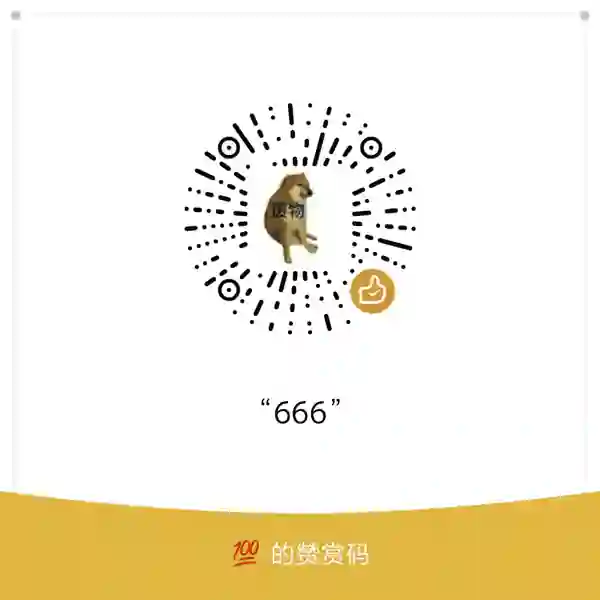

# 萌新工具箱(mxtools)

基于 **Tauri 2** 与 **Vue 3 + TypeScript + Vuetify** 的 Windows 桌面工具集,提供游戏(如 Apex 启动项)、系统与网络(如端口转发、RDP 相关)等辅助能力.具体能力以后端 `invoke` 命令与前端页面为准.

- 项目结构说明：[docs/PROJECT_STRUCTURE.md](docs/PROJECT_STRUCTURE.md)
- 更新日志：[CHANGELOG.md](docs/CHANGELOG.md)

## 使用许可

本仓库中由作者享有相应权利的原创内容采用项目自有的
[MxTools 非商业许可证 1.0](LICENSE) 许可：

- 允许非商业使用、复制、镜像分发、修改，以及公开发布非商业修改版。
- 分发时必须同时提供许可证全文，并保留 [NOTICE](NOTICE) 中所有以 `Required Notice:` 开头的声明；修改版还需清楚标注修改和“非官方修改版”。
- 出售软件、收费分发、纳入付费产品或服务，以及其他预期商业用途，需要事先取得作者的书面许可。可通过 [GitHub](https://github.com/xmx-emm)、[Bilibili](https://space.bilibili.com/231639322) 或 [QQ 频道](https://pd.qq.com/s/9cqf5hfm) 联系。
- 赞助是自愿支持，不会自动购买功能、技术支持或商业授权。

这是项目自定义的“源码可用”非商业许可证，不是 OSI 认可的开源许可证。第三方代码、模型、图片、文档及商标不由本许可证重新授权，具体范围和当前已知风险见 [THIRD_PARTY_NOTICES.md](THIRD_PARTY_NOTICES.md)。

## 赞助

如果 MxTools 对你有帮助，可以自愿赞助开发和维护。请按需要选择支付宝或微信；赞助不影响软件的免费非商业使用，也不代表取得商业授权。

<table>
  <tr>
    <th>支付宝</th>
    <th>微信赞赏码</th>
  </tr>
  <tr>
    <td align="center"></td>
    <td align="center"></td>
  </tr>
</table>

## 环境准备(Windows)

- [Node.js](https://nodejs.org/)(建议 LTS 22.19.0)
- [Rust](https://www.rust-lang.org/tools/install)(stable)及 Windows 下 MSVC 构建环境
- [WebView2 运行时](https://developer.microsoft.com/zh-cn/microsoft-edge/webview2/?form=MA13LH#download)(若系统未自带)
- 本仓库通过 `package.json` 的 devDependency 使用 `@tauri-apps/cli`,一般无需全局安装 Tauri CLI

### 本地依赖 `windows_tool`

后端依赖路径 crate `windows_tool`(见 `src-tauri/Cargo.toml`).该路径指向 `**mxtools` 仓库外侧** 的 `rust/windows_tool` 目录；若缺失会导致 `cargo` / `tauri build` 失败.布局与调整方式见 [docs/PROJECT_STRUCTURE.md](docs/PROJECT_STRUCTURE.md) 中「本地路径依赖」一节.

### 运行权限

默认以普通权限启动；注册表、系统用户、RDP、端口转发、五笔系统码表等敏感功能需要管理员时，可在对应页面点击「请求提升权限」重启（按需提权，整次会话通常只需确认一次 UAC）。请仅在信任的来源下构建与运行本程序.

## 快速开始

安装依赖：

```bash
npm install
```

仅前端开发(Vite,端口 `14200`)：

```bash
npm run dev
```

Tauri 开发(会按 `tauri.conf.json` 自动拉起前端 dev server)：

```bash
npm run "tauri dev"
```

打包 Windows 安装包/可执行文件：

```bash
npm run "build window"          # 默认打包(NSIS 安装包)
npm run "build window release"  # NSIS 安装包并重命名产物
```

PowerShell 下也可写作：`npm run "build window"`（脚本名含空格时请加引号）。

## 故障排查

### `tauri dev` 报 `EACCES: permission denied` 无法监听端口

Windows 上 Hyper-V / WSL / Docker 等可能通过 `winnat` 保留一段 TCP 端口,落在保留段内的端口绑定时会得到 `EACCES`(而非 `EADDRINUSE`).本项目开发端口为 `14200`,若你自行修改端口,请先确认不在系统保留段内：

```powershell
netsh interface ipv4 show excludedportrange protocol=tcp
```

若所选端口落在某段 `开始端口`–`结束端口` 之间,请换用段外的端口,并同步修改 `vite.config.ts` 与 `src-tauri/tauri.conf.json` 的 `devUrl`.

## 技术栈

- [Tauri](https://tauri.app/) · [Vue 3](https://vuejs.org/) · [Vite](https://vite.dev/) · [TypeScript](https://www.typescriptlang.org/)
- [Vuetify](https://vuetifyjs.com/)
- [Pinia](https://pinia.vuejs.org/) + [@tauri-store/pinia](https://github.com/tauri-apps/tauri-store)
- [vue-toastification](https://vue-toastification.maronato.dev/) · [vue-i18n](https://vue-i18n.intlify.dev/)

## 版本号(关于页)

关于页通过 `src/env.ts` 读取 `VITE_APP_VERSION`.在项目根目录 `.env` 中配置,例如：

```
VITE_APP_VERSION=0.0.3
```

同时建议与 `package.json`、`src-tauri/Cargo.toml`、`src-tauri/tauri.conf.json` 中的版本保持一致.

## Apex 启动项参考

- [Valve Developer Wiki - Command line options](https://developer.valvesoftware.com/wiki/Command_line_options)
- [EA Help - Apex Legends 如何显示 FPS](https://help.ea.com/cn/help/apex-legends/apex-legends/how-to-show-fps/)

## 推荐 IDE / 插件

- [RustRover](https://www.jetbrains.com/rust/) 或 VS Code + [rust-analyzer](https://marketplace.visualstudio.com/items?itemName=rust-lang.rust-analyzer)
- [Vue - Official (Volar)](https://marketplace.visualstudio.com/items?itemName=Vue.volar)
- [Tauri](https://marketplace.visualstudio.com/items?itemName=tauri-apps.tauri-vscode)

## 代码风格备忘

**TypeScript**

- 解析类操作用 `parseInt` / `Number` 等按场景选择
- 变量命名倾向小写加下划线：`aaa_bb`

**Rust**

- 取值类：`Option<T>`
- 可能失败的操作：`Result<T, E>`

## 开发备忘：Vuetify 主题 CSS 变量

`--v-theme-on-surface`、`--v-theme-primary` 等由 Vuetify 在运行时注入,IDE 在单文件组件中可能报「无法解析自定义属性」.

处理方式(推荐前两种)：

1. 在 IDE 中对 Vuetify 变量放行：Settings → Editor → Inspections → CSS → **Unresolved custom property**,忽略模式增加 `--v-theme-`*(或降低该检查级别).
2. 按需关闭/降级该检查.

## 其它链接(资源占位等)

- [Imgloc 图床](https://imgloc.com/)
- [Picsum Photos](https://picsum.photos)

## 版本信息所在文件

- `src-tauri/Cargo.toml`
- `src-tauri/tauri.conf.json`
- `package.json`
- `.env`

## 其它内容

### 图标生成
```
替换1024x1024.png图片后
npm run tauri icon .\src-tauri\icons\1024x1024.png
```
