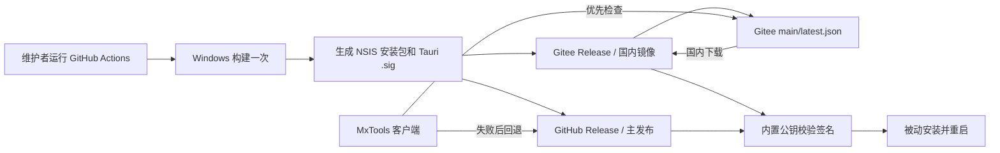

# Tauri 在线更新方案：GitHub 主发布 + Gitee 国内镜像

状态：方案已确认，尚未实施
日期：2026-08-06

## 1. 目标

- GitHub 继续作为源码、CI 和正式 Release 的唯一主发布平台。
- 国内用户默认从国内可直连的镜像下载更新。
- 不部署自有服务器，不使用现有 GitLab，不产生固定服务费用。
- 同一份构建产物同时发布到 GitHub 和国内镜像，避免重复构建造成二进制差异。
- 国内镜像不可用时，客户端能够回退到 GitHub。
- 所有自动更新包必须通过 Tauri 更新签名校验。

## 2. 方案结论

使用一个独立的 Gitee 公开仓库保存更新清单和 Release 附件，例如：

```text
https://gitee.com/<GITEE_OWNER>/mxtools-releases
```

该仓库只承担国内更新分发，不作为源码主仓库。GitHub Actions 构建一次
标准 NSIS 安装包，然后将同一份安装包和签名上传到 GitHub Release 与
Gitee Release。客户端先检查 Gitee，失败后显式重试 GitHub。



## 3. 选择理由

### Gitee 镜像

- 国内网络可直接访问，不依赖 GitHub 连通性。
- 社区版公开仓库和 Release 附件可以免费使用。
- 当前配额为附件单文件最大 100 MB、单仓库附件总容量 1 GB；MxTools
  标准 NSIS 安装包的现有门槛是小于 5 MB，满足使用条件。
- Gitee API 支持创建 Release、上传附件并返回下载地址，可由 GitHub
  Actions 自动完成。
- 不需要购买域名、云服务器或对象存储。

### 未选择的方案

- **公共 GitHub 加速代理**：域名、限速、内容策略和可用性不受项目控制，
  不作为自动更新器的固定依赖。
- **EdgeOne Makers**：虽然有免费额度，但国内长期稳定访问需要自有
  已备案域名；系统预览链接存在时效限制。
- **GitHub Pages、Cloudflare、Vercel、npm CDN**：不能同时保证国内
  可达性、安装包直链、长期稳定和零维护成本。
- **自建 GitLab 或下载服务器**：增加运维和费用，与本方案目标不符。

## 4. 首次人工配置

### 4.1 Tauri 更新签名

在维护者电脑上生成一次密钥：

```powershell
New-Item -ItemType Directory -Force "$HOME\.tauri" | Out-Null
npm.cmd run tauri signer generate -- -w "$HOME\.tauri\mxtools.key"
```

保存并备份：

- `mxtools.key`：私钥，不提交 Git。
- `mxtools.key.pub`：公钥，内容写入 Tauri updater 配置。
- 私钥密码：与私钥分开备份。

在 GitHub 仓库的 `Settings > Secrets and variables > Actions` 添加：

```text
TAURI_SIGNING_PRIVATE_KEY
TAURI_SIGNING_PRIVATE_KEY_PASSWORD
```

### 4.2 Gitee 国内镜像

1. 创建公开空仓库 `<GITEE_OWNER>/mxtools-releases`。
2. 创建只具备该仓库写入所需权限的 Gitee 私人令牌。
3. 在 GitHub Actions Secrets 中添加 `GITEE_TOKEN`。
4. 将仓库所有者和仓库名配置为工作流变量；它们不是秘密。

令牌和私钥只进入 GitHub Secrets，不写入源码、日志或发布产物。

## 5. 项目实施范围

### 5.1 Tauri 后端与配置

- 引入 `tauri-plugin-updater`，保持 Windows 原生 TLS 路线并复核发布体积。
- **体积探针结论（2026-08-13 实测，基线便携版 4,655,881 字节）**：
  - 默认特性（`rustls-tls` + `zip`）会引入第二套 TLS 栈：便携版涨到
    5,186,383 字节，超出 5,000,000 硬门槛 186,384 字节，发布门禁直接失败。
  - 必须使用
    `tauri-plugin-updater = { version = "2", default-features = false, features = ["native-tls"] }`：
    复用应用现有的 SChannel/native-tls，Windows NSIS 更新也不需要 `zip`。
    实测便携版 4,754,939 字节、安装版 4,781,710 字节，增量约 99 KB，
    门禁通过且剩余约 245 KB 余量。
- 在应用启动器中注册 updater 插件。
- 在 capability 中授予最小 updater 权限。
- 在 `tauri.conf.json` 中启用 `bundle.createUpdaterArtifacts` 并配置公钥。
- Windows 使用 Tauri 默认推荐的 `passive` 安装模式。
- 不允许降级，继续使用默认的语义版本比较。

### 5.2 客户端更新流程

客户端不要只依靠 `tauri.conf.json` 中的多个 endpoint。Tauri 官方说明，
配置端点仅在收到非 2xx 响应时继续下一个 URL；国内源连接超时等网络错误
需要应用显式处理。

推荐顺序：

1. 使用 Gitee `latest.json` 构造 updater 并检查更新。
2. 请求失败、超时或响应不可解析时，使用 GitHub `latest.json` 重试一次。
3. 任一来源返回合法的新版本后，展示版本号、更新说明和下载确认。
4. 下载时显示进度；下载或安装失败时保留当前版本并给出重试入口。
5. 下载完成后由 Tauri 校验 `.sig`，校验通过才执行安装。
6. Windows 安装前正常退出应用，安装完成后重新启动。

更新地址模板：

```text
国内：https://gitee.com/<GITEE_OWNER>/mxtools-releases/raw/main/latest.json
回退：https://github.com/xmx-emm/mxtools/releases/latest/download/latest.json
```

首个支持 updater 的版本需要用户手动安装一次；此后的更高版本才能在线更新。

### 5.3 用户界面

- 设置页提供“检查更新”入口，并显示当前版本。
- 检查中、已是最新、发现更新、下载中、安装中和失败均有明确状态。
- 不在后台无提示安装更新。
- 可在启动后低优先级自动检查，但下载和安装由用户确认。
- 更新源回退属于内部行为，不要求普通用户选择镜像。

## 6. 发布工作流

新增 Windows 专用发布工作流，使用 `workflow_dispatch` 手动触发。这样不需要
维护者在本机安装 `gh`，也不需要手工创建 Tag 或 `latest.json`。

每次发布按以下顺序执行：

1. 检查 `package.json`、`src-tauri/Cargo.toml` 与
   `src-tauri/tauri.conf.json` 的版本一致。
2. 按现有目录布局检出主仓库和 `windows_tool` 路径依赖。
3. 安装锁定的 Node 和 Rust 依赖，运行最小必要发布 Gate。
4. 使用 `tauri-apps/tauri-action@v1` 构建标准 NSIS 更新安装包。
5. 使用 Tauri 私钥生成 `.sig` 和 GitHub `latest.json`。
6. 创建已发布的 GitHub Release，并上传安装包、`.sig` 和清单。
7. 在 Gitee 创建同版本 Tag/Release，上传同一个安装包和 `.sig`。
8. 使用 Gitee API 返回的实际附件 URL 生成国内版 `latest.json`。
9. 原子更新 Gitee `main/latest.json`；只有附件上传成功后才更新清单。
10. 下载两端产物并比较 SHA-256，确认它们与本次构建文件完全一致。

现有本地 `npm.cmd run "build window release"` 继续负责便携版和 Microsoft
Store 版。第一阶段只有标准 NSIS 安装包参与在线更新，避免把三产物构建链
同时迁移到 CI。

## 7. 国内更新清单

`latest.json` 使用 Tauri v2 静态清单格式。`signature` 必须是 `.sig` 文件的
内容，不是签名文件 URL。示例：

```json
{
  "version": "0.0.7",
  "notes": "本版本更新说明",
  "pub_date": "2026-08-06T12:00:00Z",
  "platforms": {
    "windows-x86_64": {
      "url": "<GITEE_RELEASE_ASSET_DOWNLOAD_URL>",
      "signature": "<TAURI_SIGNATURE_CONTENT>"
    }
  }
}
```

清单必须最后发布，防止客户端看到尚未上传完成的版本。

## 8. 安全边界

- Tauri 更新签名与 Windows Authenticode 是两套机制。在线更新完整性依赖
  Tauri 私钥；Windows SmartScreen 信任仍需要另外的代码签名证书。
- Gitee 和 GitHub 必须分发相同的已签名安装包。
- 客户端内置公钥，私钥永不进入仓库、应用包或日志。
- 发布工作流只读取必要 Secrets，并使用最小权限。
- 签名不匹配、版本格式错误、平台不匹配或 HTTPS 失败时终止安装。
- 国内镜像被篡改时无法生成有效签名，因此客户端不会安装修改后的程序。

## 9. 验收标准

### 自动检查

- `npm.cmd run lint`
- `npm.cmd test`
- `npm.cmd run build`
- `cargo fmt --check --manifest-path src-tauri/Cargo.toml`
- `cargo clippy --manifest-path src-tauri/Cargo.toml --all-targets -- -D warnings`
- `cargo test --manifest-path src-tauri/Cargo.toml`
- `npm.cmd run "build window release"`
- `npm.cmd run release:size:check`
- `git diff --check`

### 发布验证

- GitHub 与 Gitee 安装包 SHA-256 相同。
- 两个 `latest.json` 都能解析，版本和平台字段正确。
- Gitee 可用时，客户端从 Gitee 完成检查、下载、签名校验和安装。
- 模拟 Gitee 超时或失败时，客户端改用 GitHub 并完成更新。
- 篡改安装包任意字节后，签名校验必须失败且不得启动安装。
- 当前版本等于或高于清单版本时，不提示更新。
- 更新失败后原版本仍能正常启动。

## 10. 回滚与故障处理

- **Gitee 发布失败**：不更新 Gitee `latest.json`，GitHub Release 保持可用；
  修复后重新同步相同的已签名产物。
- **错误清单**：将 Gitee `latest.json` 恢复到上一份已验证清单，或让国内
  endpoint 返回非 2xx，使客户端转入 GitHub 回退流程。
- **错误版本已发布但未安装**：撤下两端新清单，不使用同版本覆盖二进制；
  修复后发布更高的语义版本。
- **客户端更新逻辑故障**：保留 GitHub/Gitee Release 的人工下载安装入口，
  下一版本修复 updater。首个 updater 版本也按人工安装方式分发。
- 不通过关闭签名校验、允许降级或覆盖既有版本来处理发布事故。

## 11. 日常发布操作

实施完成后，维护者每次只需要：

1. 更新并核对版本号。
2. 提交并推送到 GitHub。
3. 打开 GitHub `Actions > Publish > Run workflow`。
4. 等待 GitHub Release、Gitee Release、清单发布和双端哈希验证全部通过。

## 12. 参考资料

- Tauri Updater：<https://v2.tauri.app/plugin/updater/>
- Tauri GitHub Actions：<https://v2.tauri.app/distribute/pipelines/github/>
- Tauri Action：<https://github.com/tauri-apps/tauri-action>
- GitHub Actions Secrets：<https://docs.github.com/en/actions/how-tos/write-workflows/choose-what-workflows-do/use-secrets>
- Gitee 社区版配额：<https://gitee.com/help/articles/4125>
- Gitee Release API：<https://gitee.com/sdk/gitee5j/blob/main/docs/RepositoriesApi.md>
- EdgeOne Makers 域名规则：<https://edgeone.ai/document/175201428435140608>
